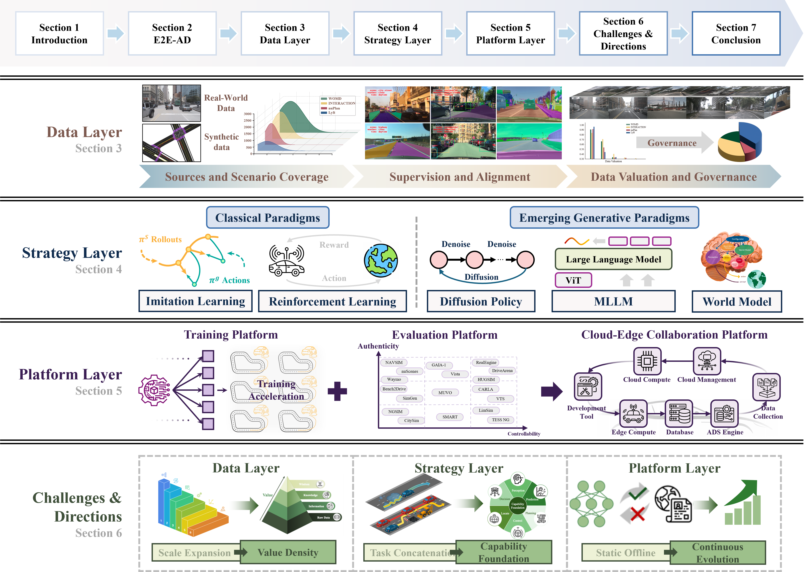

<h1 align="center">
  <strong>A Survey on End-to-End Autonomous Driving Training from the Perspectives of Data, Strategy, and Platform</strong>
</h1>

<div align="center">

[](https://www.techrxiv.org/doi/full/10.36227/techrxiv.176523171.14650662)
[](https://github.com/Jiaaqiliu/Awesome-Training-Ecosystem-for-E2E-AD/pulls)
[](https://star-history.com/#Jiaaqiliu/Awesome-Training-Ecosystem-for-E2E-AD)
[](LICENSE)

</div>

Welcome to this curated collection of papers on **End-to-End Autonomous Driving (E2E-AD)**, aimed at researchers, engineers, and enthusiasts in the field of autonomous driving systems. This repository provides a comprehensive selection of papers, focusing primarily on the training methods and ecosystems that drive the development of intelligent autonomous vehicles.

In particular, we focus on the **Data-Strategy-Platform** framework for E2E-AD systems, offering insights into:

- **Data Layer**: Addressing data collection, coverage, and governance practices.
- **Strategy Layer**: Exploring imitation learning, reinforcement learning, and generative approaches.
- **Platform Layer**: Understanding scalable training infrastructures and cloud-edge collaborations.

Each paper in this repository has been selected for its relevance and contribution to the field, and we hope it serves as a valuable resource for anyone working in or learning about autonomous driving technology.

---

#### Contributions are welcome! Please feel free to submit pull requests or reach out via email to add papers!

Feel free to explore the papers, contribute, and stay updated with the latest trends in this exciting and rapidly advancing field! If you find this repository useful, please consider citing and STARing this list ⭐. Feel free to share this list with others!

---


## 📌 Framework

<div align="center">

</div>


## Table of Contents

- [Survey paper](#survey-paper)
- [Research Papers](#research-papers) 
  - [Data Layer](#data-layer)
    - [Sources and Scenario Coverage](#Sources-and-Scenario-Coverage)
    - [Supervision and Alignment of Labels](#Supervision-and-Alignment-of-Labels)
    - [Data Valuation and Governance](#Data-Valuation-and-Governance)
  - [Strategy Layer](#strategy-layer)
    - [Imitation Learning](#Imitation-Learning)
    - [Reinforcement Learning](#Reinforcement-Learning)
    - [Diffusion Policy](#Diffusion-Policy)
    - [Multimodal Large Language Model](#Multimodal-Large-Language-Model)
    - [World Model](#World-Model)
  - [Platform Layer](#platform-layer)
    - [Distributed and Parallel Training Platform](#Distributed-and-Parallel-Training-Platform)
    - [Testing and Evaluation Platform](#Testing-and-Evaluation-Platform)
- [Datasets & Benchmarks](#Datasets-&-Benchmarks)
- [Other Awesome Lists](#Other-Awesome-Lists)
- [Citation](#Citation)


---

### **📚Survey Papers**

| **Title**                                                    |   **Year**    |    **Categories**     |                         **Project**                          |
| :----------------------------------------------------------- | :-----------: | :-------------------: | :----------------------------------------------------------: |
| [End-to-end Autonomous Driving: Challenges and Frontiers](https://ieeexplore.ieee.org/abstract/document/10614862) |  TPAMI 2025   |      End to End       | [Project](https://github.com/OpenDriveLab/End-to-end-Autonomous-Driving) |
| [A Survey of World Models for Autonomous Driving](https://arxiv.org/abs/2501.11260) |  Arxiv 2025   |      World Model      | [Project](https://github.com/FengZicai/AwesomeWMAD) / [Benchmark](https://github.com/FengZicai/WMAD-Benchmarks) |
| [Generative AI for Autonomous Driving: Frontiers and Opportunities](https://arxiv.org/abs/2505.08854) |  Arxiv 2025   |     Generative AI     |      [Project](https://github.com/taco-group/GenAI4AD)       |
| [World models for autonomous driving: An initial survey](https://ieeexplore.ieee.org/abstract/document/10522953/) |   TIV 2024    |      World Model      |                                                              |
| [Synthetic datasets for autonomous driving: A survey](https://ieeexplore.ieee.org/abstract/document/10313052/) |   TIV 2023    |       Datasets        |                                                              |
| [Explainable AI for safe and trustworthy autonomous driving: A systematic review](https://ieeexplore.ieee.org/abstract/document/10716567/) |   TITS 2024   |          XAI          |                                                              |
| [On the Prospects of Incorporating Large Language Models (LLMs) in Automated Planning and Scheduling](https://ojs.aaai.org/index.php/ICAPS/article/view/31503) |  ICAPS 2024   | Large Language Models |  [Project](https://ai4society.github.io/LLM-Planning-Viz/)   |
| [Prospective role of foundation models in advancing autonomous vehicles](https://spj.science.org/doi/full/10.34133/research.0399) | Research 2024 |   Foundation Models   |                                                              |
| [Large models for intelligent transportation systems and autonomous vehicles: A survey](https://www.sciencedirect.com/science/article/pii/S1474034624004348) |   AEI 2024    |   Foundation Models   |                                                              |
| [Vision language models in autonomous driving: A survey and outlook](https://ieeexplore.ieee.org/abstract/document/10531702/) |    IV 2024    |   Foundation Models   |   [Project](https://github.com/ge25nab/Awesome-VLM-AD-ITS)   |
| [A Survey on Multimodal Large Language Models for Autonomous Driving](https://openaccess.thecvf.com/content/WACV2024W/LLVM-AD/html/Cui_A_Survey_on_Multimodal_Large_Language_Models_for_Autonomous_Driving_WACVW_2024_paper.html) |   WACV 2024   |   Foundation Models   |                                                              |
| [A survey for foundation models in autonomous driving](https://arxiv.org/abs/2402.01105) |  Arxiv 2024   |   Foundation Models   |                                                              |
| [Forging Vision Foundation Models for Autonomous Driving: Challenges, Methodologies, and Opportunities](https://arxiv.org/abs/2401.08045) |  Arxiv 2024   |   Foundation Models   |                                                              |
| [Llm4drive: A survey of large language models for autonomous driving](https://arxiv.org/abs/2311.01043) |  Arxiv 2023   | Large Language Models |  [Project](https://github.com/Thinklab-SJTU/Awesome-LLM4AD)  |
| [V2X cooperative perception for autonomous driving: Recent advances and challenges](https://arxiv.org/abs/2310.03525) |  Arxiv 2023   |       Datasets        |                                                              |
| [Learning-based 3D Reconstruction in Autonomous Driving: A Comprehensive Survey](https://arxiv.org/abs/2503.14537) |  Arxiv 2025   |       Datasets        |                                                              |


---

### **📄Research Papers**

### **Data Layer**

#### **Sources and Scenario Coverage**

| Title                                                        | Abstract                                       | Year       | Project                                                      |
| ------------------------------------------------------------ | ---------------------------------------------- | ---------- | ------------------------------------------------------------ |
| [WOD-E2E: Waymo Open Dataset for End-to-End Driving in Challenging Long-tail Scenarios](https://arxiv.org/abs/2510.26125) | <details><summary>Details</summary> </details> | Arxiv 2025 | [Project](https://waymo.com/intl/jp/open/data/e2e/)          |
| [Simscale: Learning to drive via real-world simulation at scale](https://scholar.google.com/citations?view_op=view_citation&hl=en&user=iizqKUsAAAAJ&sortby=pubdate&citation_for_view=iizqKUsAAAAJ:hC7cP41nSMkC) | <details><summary>Details</summary> </details> | Arxiv 2025 | [Project](https://opendrivelab.com/SimScale/)                |
| [CoVLA: Comprehensive Vision-Language-Action Dataset for Autonomous Driving](https://openaccess.thecvf.com/content/WACV2025/papers/Arai_CoVLA_Comprehensive_Vision-Language-Action_Dataset_for_Autonomous_Driving_WACV_2025_paper.pdf) | <details><summary>Details</summary> </details> | WACV 2025  | [Project](https://turingmotors.github.io/covla-ad/)          |
| [Argoverse 2: Next generation datasets for self-driving perception and forecasting](https://arxiv.org/abs/2301.00493) | <details><summary>Details</summary> </details> | Arxiv 2023 | [Project](https://www.argoverse.org/av2.html)                |
| [WOMD-Reasoning: A Large-Scale Dataset for Interaction Reasoning in Driving](https://arxiv.org/abs/2407.04281) | <details><summary>Details</summary> </details> | ICML 2025  | [Code](https://github.com/yhli123/WOMD-Reasoning) / [Project](https://waymo.com/open/download) |
| [nuscenes: A multimodal dataset for autonomous driving](http://openaccess.thecvf.com/content_CVPR_2020/html/Caesar_nuScenes_A_Multimodal_Dataset_for_Autonomous_Driving_CVPR_2020_paper.html) | <details><summary>Details</summary> </details> | CVPR 2020  | [Project](https://www.nuscenes.org/)                         |
| [One million scenes for autonomous driving: Once dataset](https://arxiv.org/abs/2106.11037) | <details><summary>Details</summary> </details> | Arxiv 2021 | [Project](https://once-for-auto-driving.github.io/index.html) |
| [Scalability in perception for autonomous driving: Waymo open dataset](http://openaccess.thecvf.com/content_CVPR_2020/html/Sun_Scalability_in_Perception_for_Autonomous_Driving_Waymo_Open_Dataset_CVPR_2020_paper.html) | <details><summary>Details</summary> </details> | CVPR 2020  | [Project](http://www. waymo. com/open)                       |
| [Zenseact open dataset: A large-scale and diverse multimodal dataset for](http://openaccess.thecvf.com/content/ICCV2023/html/Alibeigi_Zenseact_Open_Dataset_A_Large-Scale_and_Diverse_Multimodal_Dataset_for_ICCV_2023_paper.html) | <details><summary>Details</summary> </details> | ICCV 2023  | [Project](zod.zenseact.com)                                  |
| [Scaling out-of-distribution detection for real-world settings](https://arxiv.org/abs/1911.11132) | <details><summary>Details</summary> </details> | PMLR 2022  | [Code](https://github.com/hendrycks/anomaly-seg)             |
| [SHIFT: a synthetic driving dataset for continuous multi-task domain adaptation](http://openaccess.thecvf.com/content/CVPR2022/html/Sun_SHIFT_A_Synthetic_Driving_Dataset_for_Continuous_Multi-Task_Domain_Adaptation_CVPR_2022_paper.html) | <details><summary>Details</summary> </details> | CVPR 2022  | [Project](https://www.vis.xyz/shift.)                        |
| [V2x-vit: Vehicle-to-everything cooperative perception with vision transformer](https://link.springer.com/chapter/10.1007/978-3-031-19842-7_7) | <details><summary>Details</summary> </details> | ECCV 2022  | [Code](https://github.com/DerrickXuNu/v2x-vit)               |
| [Deepaccident: A motion and accident prediction benchmark for v2x autonomous driving](https://ojs.aaai.org/index.php/AAAI/article/view/28370) | <details><summary>Details</summary> </details> | AAAI 2024  | [Project]()                                                  |
| [Bdd100k: A diverse driving dataset for heterogeneous multitask learning](http://openaccess.thecvf.com/content_CVPR_2020/html/Yu_BDD100K_A_Diverse_Driving_Dataset_for_Heterogeneous_Multitask_Learning_CVPR_2020_paper.html) | <details><summary>Details</summary> </details> | CVPR 2020  | [Project](https://bair.berkeley.edu/blog/2018/05/30/bdd/)    |
| [The apolloscape dataset for autonomous driving](https://openaccess.thecvf.com/content_cvpr_2018_workshops/w14/html/Huang_The_ApolloScape_Dataset_CVPR_2018_paper.html?ref=https://githubhelp.com) | <details><summary>Details</summary> </details> | CVPR 2018  | [Prioject](https://apolloscape.auto/)                        |
| [Tumtraf v2x cooperative perception dataset](http://openaccess.thecvf.com/content/CVPR2024/html/Zimmer_TUMTraf_V2X_Cooperative_Perception_Dataset_CVPR_2024_paper.html) | <details><summary>Details</summary> </details> | CVPR 2024  | [Project](https://tum-traffic-dataset.github.io/tumtraf-v2x/) |
| [Tumtraf intersection dataset: All you need for urban 3d camera-lidar roadside perception](https://ieeexplore.ieee.org/abstract/document/10422289/) | <details><summary>Details</summary> </details> | ITSC 2023  | [Code](https://innovation-mobility.com/tumtraf-dataset.)     |
| [V2v4real: A real-world large-scale dataset for vehicle-to-vehicle cooperative perception](http://openaccess.thecvf.com/content/CVPR2023/html/Xu_V2V4Real_A_Real-World_Large-Scale_Dataset_for_Vehicle-to-Vehicle_Cooperative_Perception_CVPR_2023_paper.html) | <details><summary>Details</summary> </details> | CVPR 2023  | [Project](research.seas.ucla.edu/mobility-lab/v2v4real/)     |
| [Rope3d: The roadside perception dataset for autonomous driving and monocular 3d object detection task](http://openaccess.thecvf.com/content/CVPR2022/html/Ye_Rope3D_The_Roadside_Perception_Dataset_for_Autonomous_Driving_and_Monocular_CVPR_2022_paper.html) | <details><summary>Details</summary> </details> | CVPR 2022  | [Project](https://thudair.baai.ac.cn/rope)                   |
| [Cooperative perception for 3D object detection in driving scenarios using infrastructure sensors](https://ieeexplore.ieee.org/abstract/document/9228884/) | <details><summary>Details</summary> </details> | TITS 2020  |                                                              |
| [Lumpi: The leibniz university multi-perspective intersection dataset](https://ieeexplore.ieee.org/abstract/document/9827157/) | <details><summary>Details</summary> </details> | IV 2022    | [Project](https://data.uni-hannover.de/cs_CZ/dataset/lumpi)  |
| [An automated driving systems data acquisition and analytics platform](https://www.sciencedirect.com/science/article/pii/S0968090X23001092) | <details><summary>Details</summary> </details> | TRC 2023   |                                                              |
| [S-nerf++: Autonomous driving simulation via neural reconstruction and generation](https://ieeexplore.ieee.org/abstract/document/10891659/) | <details><summary>Details</summary> </details> | TPAMI 2025 | [Code](https://github.com/fudan-zvg/S-NeRF)                  |
| [Scene reconstruction techniques for autonomous driving: a review of 3D Gaussian splatting](https://link.springer.com/article/10.1007/s10462-024-10955-4) | <details><summary>Details</summary> </details> | AIR        |                                                              |
| [Driving into the future: Multiview visual forecasting and planning with world model for autonomous driving](https://openaccess.thecvf.com/content/CVPR2024/html/Wang_Driving_into_the_Future_Multiview_Visual_Forecasting_and_Planning_with_CVPR_2024_paper.html) | <details><summary>Details</summary> </details> | CVPR 2024  | [Code](https://github.com/BraveGroup/Drive-WM) / [Project](https://drive-wm.github.io/) |
| [Scenecontrol: Diffusion for controllable traffic scene generation](https://ieeexplore.ieee.org/abstract/document/10610324/) | <details><summary>Details</summary> </details> | ICRA 2024  |                                                              |
| [Diffscene: Diffusion-based safety-critical scenario generation for autonomous vehicles](https://ojs.aaai.org/index.php/AAAI/article/view/32951) | <details><summary>Details</summary> </details> | AAAI 2025  |                                                              |
| [Simulation-based reinforcement learning for real-world autonomous driving](https://ieeexplore.ieee.org/abstract/document/9196730/) | <details><summary>Details</summary> </details> | ICRA 2020  |                                                              |

#### **Supervision and Alignment of Labels**

| Title                                                        | Abstract                                       | Year         | Project                                                    |
| ------------------------------------------------------------ | ---------------------------------------------- | ------------ | ---------------------------------------------------------- |
| [Openannotate2: Multi-modal auto-annotating for autonomous driving](https://ieeexplore.ieee.org/abstract/document/10480248/) | <details><summary>Details</summary> </details> | TIV 2024     | [Code](https://github.com/Fudan-ProjectTitan/OpenAnnotate) |
| [Masked-attention mask transformer for universal image segmentation](http://openaccess.thecvf.com/content/CVPR2022/html/Cheng_Masked-Attention_Mask_Transformer_for_Universal_Image_Segmentation_CVPR_2022_paper.html) | <details><summary>Details</summary> </details> | CVPR 2022    | [Code](https://github.com/facebookresearch/Mask2Former)    |
| [Per-pixel classification is not all you need for semantic segmentation](https://proceedings.neurips.cc/paper/2021/hash/950a4152c2b4aa3ad78bdd6b366cc179-Abstract.html) | <details><summary>Details</summary> </details> | NeurIPS 2021 |                                                            |
| [Automatic model-based dataset generation for high-level vision tasks of autonomous driving in haze weather](https://ieeexplore.ieee.org/abstract/document/9964250/) | <details><summary>Details</summary> </details> | TII 2022     |                                                            |
| [Learning to Drive Anywhere with Model-Based Reannotation](https://arxiv.org/abs/2505.05592) | <details><summary>Details</summary> </details> | Arxiv 2025   |                                                            |
| [Proximity based automatic data annotation for autonomous driving](https://ieeexplore.ieee.org/abstract/document/9016395/) | <details><summary>Details</summary> </details> | JAS 2020     |                                                            |
| [Towards a weakly supervised framework for 3D point cloud object detection and annotation](https://ieeexplore.ieee.org/abstract/document/9369074/) | <details><summary>Details</summary> </details> | TPAMI 2021   |                                                            |
| [DrivingDiffusion: layout-guided multi-view driving scenarios video generation with latent diffusion model](https://link.springer.com/chapter/10.1007/978-3-031-73229-4_27) | <details><summary>Details</summary> </details> | ECCV 2024    |                                                            |
| [Adaptive fusion of single-view and multi-view depth for autonomous driving](http://openaccess.thecvf.com/content/CVPR2024/html/Cheng_Adaptive_Fusion_of_Single-View_and_Multi-View_Depth_for_Autonomous_Driving_CVPR_2024_paper.html) | <details><summary>Details</summary> </details> | CVPR 2024    | [Project](https://github.com/Junda24/AFNet/)               |
| [Image-to-lidar self-supervised distillation for autonomous driving data](http://openaccess.thecvf.com/content/CVPR2022/html/Sautier_Image-to-Lidar_Self-Supervised_Distillation_for_Autonomous_Driving_Data_CVPR_2022_paper.html) | <details><summary>Details</summary> </details> | CVPR 2022    | [Code](https://github.com/valeoai/SLidR)                   |
| [A simple vision transformer for weakly semi-supervised 3d object detection](http://openaccess.thecvf.com/content/ICCV2023/html/Zhang_A_Simple_Vision_Transformer_for_Weakly_Semi-supervised_3D_Object_Detection_ICCV_2023_paper.html) | <details><summary>Details</summary> </details> | ICCV 2023    |                                                            |
| [Active learning of driving scenario trajectories](https://www.sciencedirect.com/science/article/pii/S0952197622001750) | <details><summary>Details</summary> </details> | EAAI 2022    |                                                            |

#### **Data Valuation and Governance**

| Title                                                        | Abstract                                       | Year          | Project                                                |
| ------------------------------------------------------------ | ---------------------------------------------- | ------------- | ------------------------------------------------------ |
| [Diversified Critical-Scenario-Search for Defect Detection of Autonomous Driving System](https://ieeexplore.ieee.org/abstract/document/10557770/) | <details><summary>Details</summary> </details> | TIV 2024      |                                                        |
| [Boosting offline reinforcement learning for autonomous driving with hierarchical latent skills](https://ieeexplore.ieee.org/abstract/document/10611197/) | <details><summary>Details</summary> </details> | ICRA 2024     |                                                        |
| [A scenario distribution model for effective and efficient testing of autonomous driving systems](https://dl.acm.org/doi/abs/10.1145/3551349.3563239) | <details><summary>Details</summary> </details> | ASE 2022      |                                                        |
| [Did we test all scenarios for automated and autonomous driving systems?](https://ieeexplore.ieee.org/abstract/document/8917326/) | <details><summary>Details</summary> </details> | ITSC 2019     |                                                        |
| [Steerable Adversarial Scenario Generation through Test-Time Preference Alignment](https://arxiv.org/abs/2509.20102) | <details><summary>Details</summary> </details> | Arxiv 2025    | [Project](https://tongnie.github.io/SAGE/)             |
| [Llm-attacker: Enhancing closed-loop adversarial scenario generation for autonomous driving with large language models](https://arxiv.org/abs/2501.15850) | <details><summary>Details</summary> </details> | Arxiv 2025    |                                                        |
| [Embedding synthetic off-policy experience for autonomous driving via zero-shot curricula](https://proceedings.mlr.press/v205/bronstein23a.html) | <details><summary>Details</summary> </details> | CRL 2023      |                                                        |
| [Quantitative representation of autonomous driving scenario difficulty based on adversarial policy search](https://spj.science.org/doi/full/10.34133/research.0575) | <details><summary>Details</summary> </details> | Research 2025 | [Project](https://www.youtube.com/watch?v=GceGdqAm9Ys) |
| [King: Generating safety-critical driving scenarios for robust imitation via kinematics gradients](https://link.springer.com/chapter/10.1007/978-3-031-19839-7_20) | <details><summary>Details</summary> </details> | ECCV 2022     |                                                        |
| [Mitigating bias of deep neural networks for trustworthy traffic perception in autonomous systems](https://ieeexplore.ieee.org/abstract/document/10588805/) | <details><summary>Details</summary> </details> | IV 2024       |                                                        |
| [Privacy-preserved federated learning for autonomous driving](https://ieeexplore.ieee.org/abstract/document/9457207/) | <details><summary>Details</summary> </details> | TITS 2021     |                                                        |
| [ADD: An automatic desensitization fisheye dataset for autonomous driving](https://www.sciencedirect.com/science/article/pii/S0952197623009508) | <details><summary>Details</summary> </details> | EAAI 2023     |                                                        |
| [Federated vehicular transformers and their federations: Privacy-preserving computing and cooperation for autonomous driving](https://ieeexplore.ieee.org/abstract/document/9857660/) | <details><summary>Details</summary> </details> | TIV 2022      |                                                        |

---

### Strategy Layer

#### **Imitation Learning**

| Title                                                        | Abstract                                       | Year       | Project                                                      |
| ------------------------------------------------------------ | ---------------------------------------------- | ---------- | ------------------------------------------------------------ |
| [Planning-oriented autonomous driving](http://openaccess.thecvf.com/content/CVPR2023/html/Hu_Planning-Oriented_Autonomous_Driving_CVPR_2023_paper.html) | <details><summary>Details</summary> </details> | CVPR 2023  | [Code](https://github.com/OpenDriveLab/UniAD)                |
| [Transfuser: Imitation with transformer-based sensor fusion for autonomous driving](https://ieeexplore.ieee.org/abstract/document/9863660/) | <details><summary>Details</summary> </details> | TPAMI 2022 | [Code](https://github.com/autonomousvision/transfuser.git)   |
| [Safety-enhanced autonomous driving using interpretable sensor fusion transformer](https://proceedings.mlr.press/v205/shao23a.html) | <details><summary>Details</summary> </details> | CoRL 2022  | [Code](https://github.com/opendilab/InterFuser)              |
| [Reasonnet: End-to-end driving with temporal and global reasoning](http://openaccess.thecvf.com/content/CVPR2023/html/Shao_ReasonNet_End-to-End_Driving_With_Temporal_and_Global_Reasoning_CVPR_2023_paper.html) | <details><summary>Details</summary> </details> | CVPR 2023  | [Code](https://github.com/opendilab/DOS)                     |
| [Ppad: Iterative interactions of prediction and planning for end-to-end autonomous driving](https://link.springer.com/chapter/10.1007/978-3-031-72761-0_14) | <details><summary>Details</summary> </details> | ECCV 2024  | [Code](https://github.com/zlichen/PPAD)                      |
| [Multi-modal fusion transformer for end-to-end autonomous driving](http://openaccess.thecvf.com/content/CVPR2021/html/Prakash_Multi-Modal_Fusion_Transformer_for_End-to-End_Autonomous_Driving_CVPR_2021_paper.html) | <details><summary>Details</summary> </details> | CVPR 2021  | [Code](https://github.com/autonomousvision/transfuser.git)   |
| [Think twice before driving: Towards scalable decoders for end-to-end autonomous driving](http://openaccess.thecvf.com/content/CVPR2023/html/Jia_Think_Twice_Before_Driving_Towards_Scalable_Decoders_for_End-to-End_Autonomous_CVPR_2023_paper.html) | <details><summary>Details</summary> </details> | CVPR 2023  | [Code](https://github.com/OpenDriveLab/ThinkTwice)           |
| [Learning from all vehicles](http://openaccess.thecvf.com/content/CVPR2022/html/Chen_Learning_From_All_Vehicles_CVPR_2022_paper.html) | <details><summary>Details</summary> </details> | CVPR 2022  | [Code](https://github.com/dotchen/LAV.git)                   |
| [Neat: Neural attention fields for end-to-end autonomous driving](http://openaccess.thecvf.com/content/ICCV2021/html/Chitta_NEAT_Neural_Attention_Fields_for_End-to-End_Autonomous_Driving_ICCV_2021_paper.html) | <details><summary>Details</summary> </details> | ICCV 2021  | [Code](https://github.com/autonomousvision/neat.git)         |
| [Learning to steer by mimicking features from heterogeneous auxiliary networks](https://aaai.org/ojs/index.php/AAAI/article/view/4859) | <details><summary>Details</summary> </details> | AAAI 2019  | [Code](https://github.com/cardwing/Codes-for-Steering-Control.git) |
| [Driving on Registers](https://arxiv.org/html/2601.05083v1)  | <details><summary>Details</summary> </details> | Arxiv 2026 |                                                              |


#### **Reinforcement Learning**

| Title                                                        | Abstract                                                     | Year       | Project                                                      |
| ------------------------------------------------------------ | ------------------------------------------------------------ | ---------- | ------------------------------------------------------------ |
| [ThinkDrive: Chain-of-Thought Guided Progressive Reinforcement Learning Fine-Tuning for Autonomous Driving](https://arxiv.org/abs/2601.04714) | <details><summary>With the rapid advancement of large language models (LLMs) technologies, their application in the domain of autonomous driving has become increasingly widespread. However, existing methods suffer from unstructured reasoning, poor generalization, and misalignment with human driving intent. While Chain-of-Thought (CoT) reasoning enhances decision transparency, conventional supervised fine-tuning (SFT) fails to fully exploit its potential, and reinforcement learning (RL) approaches face instability and suboptimal reasoning depth. We propose ThinkDrive, a CoT guided progressive RL fine-tuning framework for autonomous driving that synergizes explicit reasoning with difficulty-aware adaptive policy optimization. Our method employs a two-stage training strategy. First, we perform SFT using CoT explanations. Then, we apply progressive RL with a difficulty-aware adaptive policy optimizer that dynamically adjusts learning intensity based on sample complexity. We evaluate our approach on a public dataset. The results show that ThinkDrive outperforms strong RL baselines by 1.45%, 1.95%, and 1.01% on exam, easy-exam, and accuracy, respectively. Moreover, a 2B-parameter model trained with our method surpasses the much larger GPT-4o by 3.28% on the exam metric.</summary> </details> | Arxiv 2026 |                                                              |
| [Effective Learning Mechanism Based on Reward-Oriented Hierarchies for Sim-to-Real Adaption in Autonomous Driving Systems](https://ieeexplore.ieee.org/abstract/document/10840284/) | <details><summary>Details</summary> </details>               | TITS 2025  |                                                              |
| [Safe-state enhancement method for autonomous driving via direct hierarchical reinforcement learning](https://ieeexplore.ieee.org/abstract/document/10120651/) | <details><summary>Details</summary> </details>               | TITS 2023  |                                                              |
| [Imitation is not enough: Robustifying imitation with reinforcement learning for challenging driving scenarios](https://ieeexplore.ieee.org/abstract/document/10342038/) | <details><summary>Details</summary> </details>               | IROS 2023  |                                                              |
| [Safe reinforcement learning for autonomous vehicle using monte carlo tree search](https://ieeexplore.ieee.org/abstract/document/9376709/) | <details><summary>Details</summary> </details>               | TITS 2021  |                                                              |
| [Uncertainty-aware model-based reinforcement learning: Methodology and application in autonomous driving](https://ieeexplore.ieee.org/abstract/document/9802913/) | <details><summary>Details</summary> </details>               | TIV 2022   |                                                              |
| [Safety-aware causal representation for trustworthy offline reinforcement learning in autonomous driving](https://ieeexplore.ieee.org/abstract/document/10476686/) | <details><summary>Details</summary> </details>               | RAL 2024   |                                                              |
| [Improving generalization of transfer learning across domains using spatio-temporal features in autonomous driving](https://arxiv.org/abs/2103.08116) | <details><summary>Details</summary> </details>               | Arxiv 2021 |                                                              |
| [Towards socially responsive autonomous vehicles: A reinforcement learning framework with driving priors and coordination awareness](https://ieeexplore.ieee.org/abstract/document/10315232/) | <details><summary>Details</summary> </details>               | TIV 2023   |                                                              |
| [Uncertainty-aware model-based offline reinforcement learning for automated driving](https://ieeexplore.ieee.org/abstract/document/10015868/) | <details><summary>Details</summary> </details>               | RAL 2023   |                                                              |
| [Towards safe and robust autonomous vehicle platooning: A self-organizing cooperative control framework](https://arxiv.org/abs/2408.09468) | <details><summary>Details</summary> </details>               | Arxiv 2024 | [Project](https://perfectxu88.github.io/towardssafeandrobust.github.io/) |
| [Reinforced Refinement with Self-Aware Expansion for End-to-End Autonomous Driving](https://scholar.google.com/citations?view_op=view_citation&hl=en&user=iizqKUsAAAAJ&sortby=pubdate&citation_for_view=iizqKUsAAAAJ:7PzlFSSx8tAC) | <details><summary>Details</summary> </details>               | TPAMI 2026 |                                                              |


#### **Diffusion Policy**

| Title                                                        | Abstract                                                     | Year       | Project                                                      |
| ------------------------------------------------------------ | ------------------------------------------------------------ | ---------- | ------------------------------------------------------------ |
| [Dichotomous Diffusion Policy Optimization](https://arxiv.org/abs/2601.00898) | <details><summary>Diffusion-based policies have gained growing popularity in solving a wide range of decision-making tasks due to their superior expressiveness and controllable generation during inference. However, effectively training large diffusion policies using reinforcement learning (RL) remains challenging. Existing methods either suffer from unstable training due to directly maximizing value objectives, or face computational issues due to relying on crude Gaussian likelihood approximation, which requires a large amount of sufficiently small denoising steps. In this work, we propose DIPOLE (Dichotomous diffusion Policy improvement), a novel RL algorithm designed for stable and controllable diffusion policy optimization. We begin by revisiting the KL-regularized objective in RL, which offers a desirable weighted regression objective for diffusion policy extraction, but often struggles to balance greediness and stability. We then formulate a greedified policy regularization scheme, which naturally enables decomposing the optimal policy into a pair of stably learned dichotomous policies: one aims at reward maximization, and the other focuses on reward minimization. Under such a design, optimized actions can be generated by linearly combining the scores of dichotomous policies during inference, thereby enabling flexible control over the level of [this http URL](http://greediness.evaluations/) in offline and offline-to-online RL settings on ExORL and OGBench demonstrate the effectiveness of our approach. We also use DIPOLE to train a large vision-language-action (VLA) model for end-to-end autonomous driving (AD) and evaluate it on the large-scale real-world AD benchmark NAVSIM, highlighting its potential for complex real-world applications.</summary> </details> | Arxiv 2026 |                                                              |
| [WAM-Flow: Parallel Coarse-to-Fine Motion Planning via Discrete Flow Matching for Autonomous Driving](https://arxiv.org/abs/2512.06112) | <details><summary>Details</summary> </details>               | Arxiv 2025 | [code](https://github.com/fudan-generative-vision/WAM-Flow)  |
| [Diffusiondrive: Truncated diffusion model for end-to-end autonomous driving](http://openaccess.thecvf.com/content/CVPR2025/html/Liao_DiffusionDrive_Truncated_Diffusion_Model_for_End-to-End_Autonomous_Driving_CVPR_2025_paper.html) | <details><summary>Details</summary> </details>               | CVPR  2025 | [Code](https://github.com/hustvl/DiffusionDrive)             |
| [Diffvla: Vision-language guided diffusion planning for autonomous driving](https://arxiv.org/abs/2505.19381) | <details><summary>Details</summary> </details>               | Arxiv 2025 |                                                              |
| [DiffAD: A Unified Diffusion Modeling Approach for Autonomous Driving](https://arxiv.org/abs/2503.12170) | <details><summary>Details</summary> </details>               | Arxiv 2025 |                                                              |
| [A Knowledge-Driven Diffusion Policy for End-to-End Autonomous Driving Based on Expert Routing](https://arxiv.org/abs/2509.04853) | <details><summary>Details</summary> </details>               | Arxiv 2025 | [Code](https://github.com/PerfectXu88/KDP-AD) / [Project](https://perfectxu88.github.io/KDP-AD/) |
| [Diffusion-based planning for autonomous driving with flexible guidance](https://arxiv.org/abs/2501.15564) | <details><summary>Details</summary> </details>               | Arxiv 2025 |                                                              |
| [Diffusion-ES: Gradient-free planning with diffusion for autonomous and instruction-guided driving](http://openaccess.thecvf.com/content/CVPR2024/html/Yang_Diffusion-ES_Gradient-free_Planning_with_Diffusion_for_Autonomous_and_Instruction-guided_Driving_CVPR_2024_paper.html) | <details><summary>Details</summary> </details>               | CVPR 2024  |                                                              |
| [Uncertainty-Based Alternative Diffusion Policy for Safe Autonomous Driving](https://ieeexplore.ieee.org/abstract/document/11083769/) | <details><summary>Details</summary> </details>               | TITS 2025  |                                                              |
| [Recogdrive: A reinforced cognitive framework for end-to-end autonomous driving](https://arxiv.org/abs/2506.08052) | <details><summary>Details</summary> </details>               | Arxiv 2025 |                                                              |
| [FlowDrive: Energy Flow Field for End-to-End Autonomous Driving](https://arxiv.org/abs/2509.14303) | <details><summary>Details</summary> </details>               | Arxiv 2025 | [Project](https://astrixdrive.github.io/FlowDrive.github.io/) |
| [Diffusion-based planning for autonomous driving with flexible guidance](https://arxiv.org/abs/2501.15564) | <details><summary>Details</summary> </details>               | Arxiv 2025 |                                                              |


#### **Multimodal Large Language Model**

| Title                                                        | Abstract                                                     | Year       | Project                                                      |
| ------------------------------------------------------------ | ------------------------------------------------------------ | ---------- | ------------------------------------------------------------ |
| [Modular Autonomy with Conversational Interaction: An LLM-driven Framework for Decision Making in Autonomous Driving](https://arxiv.org/abs/2601.05806) | <details><summary>Recent advancements in Large Language Models (LLMs) offer new opportunities to create natural language interfaces for Autonomous Driving Systems (ADSs), moving beyond rigid inputs. This paper addresses the challenge of mapping the complexity of human language to the structured action space of modular ADS software. We propose a framework that integrates an LLM-based interaction layer with Autoware, a widely used open-source software. This system enables passengers to issue high-level commands, from querying status information to modifying driving behavior. Our methodology is grounded in three key components: a taxonomization of interaction categories, an application-centric Domain Specific Language (DSL) for command translation, and a safety-preserving validation layer. A two-stage LLM architecture ensures high transparency by providing feedback based on the definitive execution status. Evaluation confirms the system's timing efficiency and translation robustness. Simulation successfully validated command execution across all five interaction categories. This work provides a foundation for extensible, DSL-assisted interaction in modular and safety-conscious autonomy stacks.</summary> </details> | IV 2026 |  |
| [SGDrive: Scene-to-Goal Hierarchical World Cognition for Autonomous Driving](https://arxiv.org/abs/2601.05640) | <details><summary>Recent end-to-end autonomous driving approaches have leveraged Vision-Language Models (VLMs) to enhance planning capabilities in complex driving scenarios. However, VLMs are inherently trained as generalist models, lacking specialized understanding of driving-specific reasoning in 3D space and time. When applied to autonomous driving, these models struggle to establish structured spatial-temporal representations that capture geometric relationships, scene context, and motion patterns critical for safe trajectory planning. To address these limitations, we propose SGDrive, a novel framework that explicitly structures the VLM's representation learning around driving-specific knowledge hierarchies. Built upon a pre-trained VLM backbone, SGDrive decomposes driving understanding into a scene-agent-goal hierarchy that mirrors human driving cognition: drivers first perceive the overall environment (scene context), then attend to safety-critical agents and their behaviors, and finally formulate short-term goals before executing actions. This hierarchical decomposition provides the structured spatial-temporal representation that generalist VLMs lack, integrating multi-level information into a compact yet comprehensive format for trajectory planning. Extensive experiments on the NAVSIM benchmark demonstrate that SGDrive achieves state-of-the-art performance among camera-only methods on both PDMS and EPDMS, validating the effectiveness of hierarchical knowledge structuring for adapting generalist VLMs to autonomous driving.</summary> </details> | Arxiv 2026 |  |
| [LatentVLA: Efficient Vision-Language Models for Autonomous Driving via Latent Action Prediction](https://arxiv.org/abs/2601.05611) | <details><summary>End-to-end autonomous driving models trained on largescale datasets perform well in common scenarios but struggle with rare, long-tail situations due to limited scenario diversity. Recent Vision-Language-Action (VLA) models leverage broad knowledge from pre-trained visionlanguage models to address this limitation, yet face critical challenges: (1) numerical imprecision in trajectory prediction due to discrete tokenization, (2) heavy reliance on language annotations that introduce linguistic bias and annotation burden, and (3) computational inefficiency from multi-step chain-of-thought reasoning hinders real-time deployment. We propose LatentVLA, a novel framework that employs self-supervised latent action prediction to train VLA models without language annotations, eliminating linguistic bias while learning rich driving representations from unlabeled trajectory data. Through knowledge distillation, LatentVLA transfers the generalization capabilities of VLA models to efficient vision-based networks, achieving both robust performance and real-time efficiency. LatentVLA establishes a new state-of-the-art on the NAVSIM benchmark with a PDMS score of 92.4 and demonstrates strong zeroshot generalization on the nuScenes benchmark.</summary> </details> | Arxiv 2026 |  |
| [A Vision-Language-Action Model with Visual Prompt for OFF-Road Autonomous Driving](https://arxiv.org/abs/2601.03519) | <details><summary>Efficient trajectory planning in off-road terrains presents a formidable challenge for autonomous vehicles, often necessitating complex multi-step pipelines. However, traditional approaches exhibit limited adaptability in dynamic environments. To address these limitations, this paper proposes OFF-EMMA, a novel end-to-end multimodal framework designed to overcome the deficiencies of insufficient spatial perception and unstable reasoning in visual-language-action (VLA) models for off-road autonomous driving scenarios. The framework explicitly annotates input images through the design of a visual prompt block and introduces a chain-of-thought with self-consistency (COT-SC) reasoning strategy to enhance the accuracy and robustness of trajectory planning. The visual prompt block utilizes semantic segmentation masks as visual prompts, enhancing the spatial understanding ability of pre-trained visual-language models for complex terrains. The COT- SC strategy effectively mitigates the error impact of outliers on planning performance through a multi-path reasoning mechanism. Experimental results on the RELLIS-3D off-road dataset demonstrate that OFF-EMMA significantly outperforms existing methods, reducing the average L2 error of the Qwen backbone model by 13.3% and decreasing the failure rate from 16.52% to 6.56%.</summary> </details> | Arxiv 2026 |  |
| [FROST-Drive: Scalable and Efficient End-to-End Driving with a Frozen Vision Encoder](https://arxiv.org/abs/2601.03460) | <details><summary>Details</summary> </details> | Arxiv 2026 |  |
| [Counterfactual VLA: Self-Reflective Vision-Language-Action Model with Adaptive Reasoning](https://arxiv.org/abs/2512.24426) | <details><summary>Recent reasoning-augmented Vision-Language-Action (VLA) models have improved the interpretability of end-to-end autonomous driving by generating intermediate reasoning traces. Yet these models primarily describe what they perceive and intend to do, rarely questioning whether their planned actions are safe or appropriate. This work introduces Counterfactual VLA (CF-VLA), a self-reflective VLA framework that enables the model to reason about and revise its planned actions before execution. CF-VLA first generates time-segmented meta-actions that summarize driving intent, and then performs counterfactual reasoning conditioned on both the meta-actions and the visual context. This step simulates potential outcomes, identifies unsafe behaviors, and outputs corrected meta-actions that guide the final trajectory generation. To efficiently obtain such self-reflective capabilities, we propose a rollout-filter-label pipeline that mines high-value scenes from a base (non-counterfactual) VLA's rollouts and labels counterfactual reasoning traces for subsequent training rounds. Experiments on large-scale driving datasets show that CF-VLA improves trajectory accuracy by up to 17.6%, enhances safety metrics by 20.5%, and exhibits adaptive thinking: it only enables counterfactual reasoning in challenging scenarios. By transforming reasoning traces from one-shot descriptions to causal self-correction signals, CF-VLA takes a step toward self-reflective autonomous driving agents that learn to think before they act.</summary> </details> | Arxiv 2025 |  |
| [KnowVal: A Knowledge-Augmented and Value-Guided Autonomous Driving System](https://arxiv.org/abs/2512.20299) | <details><summary>Visual-language reasoning, driving knowledge, and value alignment are essential for advanced autonomous driving systems. However, existing approaches largely rely on data-driven learning, making it difficult to capture the complex logic underlying decision-making through imitation or limited reinforcement rewards. To address this, we propose KnowVal, a new autonomous driving system that enables visual-language reasoning through the synergistic integration of open-world perception and knowledge retrieval. Specifically, we construct a comprehensive driving knowledge graph that encodes traffic laws, defensive driving principles, and ethical norms, complemented by an efficient LLM-based retrieval mechanism tailored for driving scenarios. Furthermore, we develop a human-preference dataset and train a Value Model to guide interpretable, value-aligned trajectory assessment. Experimental results show that our method substantially improves planning performance while remaining compatible with existing architectures. Notably, KnowVal achieves the lowest collision rate on nuScenes and state-of-the-art results on Bench2Drive.</summary> </details> | Arxiv 2025 |  |
| [FutureSightDrive: Thinking Visually with Spatio-Temporal CoT for Autonomous Driving](https://arxiv.org/abs/2505.17685) | <details><summary>Details</summary> </details> | Arxiv 2025 | [Code](https://github.com/MIV-XJTU/FSDrive) |
| [ReCogDrive: A Reinforced Cognitive Framework for End-to-End Autonomous Driving](https://arxiv.org/abs/2506.08052) | <details><summary>Details</summary></details> | Arxiv 2025 | [Project](https://xiaomi-research.github.io/recogdrive/) / [Code](https://xiaomi-research.github.io/recogdrive/) |
| [DriveMoE: Mixture-of-Experts for Vision-Language-Action Model in End-to-End Autonomous Driving](https://arxiv.org/abs/2505.16278) | <details><summary>Details</summary></details>                | Arxiv 2025 | [Project](https://thinklab-sjtu.github.io/DriveMoE/)         |
| [DSDrive: Distilling Large Language Model for Lightweight End-to-End Autonomous Driving with Unified Reasoning and Planning](https://arxiv.org/abs/2505.05360) | <details><summary>Details</summary></details> | Arxiv 2025 |  |
| [OpenDriveVLA: Towards End-to-end Autonomous Driving with Large Vision Language Action Model](https://arxiv.org/pdf/2503.23463) | <details><summary>Details</summary> </details>               | Arxiv 2025 | [Code](https://github.com/DriveVLA/OpenDriveVLA)             |
| [Impromptu VLA: Open Weights and Open Data for Driving Vision-Language-Action Models](https://arxiv.org/abs/2505.23757) | <details><summary>Details</summary></details>                | Arxiv 2025 | [Code](https://github.com/ahydchh/Impromptu-VLA) / [Project](http://impromptu-vla.c7w.tech/) |
| [Towards Human-Centric Autonomous Driving: A Fast-Slow Architecture Integrating Large Language Model Guidance with Reinforcement Learning](https://arxiv.org/abs/2505.06875) | <details><summary>Details</summary></details> | ITSC 2025 | [Project](https://drive.google.com/drive/folders/1K0WgRw1SdJL-JufvJNaTO1ES5SOuSj6p?usp=sharing) |
| [DriveRX: A Vision-Language Reasoning Model for Cross-Task Autonomous Driving](https://arxiv.org/abs/2505.20665) | <details><summary>Details</summary></details> | Arxiv 2025 | [Project](https://pris-cv.github.io/DriveRX/) |
| [DiffVLA: Vision-Language Guided Diffusion Planning for Autonomous Driving](https://arxiv.org/abs/2505.19381) | <details><summary>Details</summary></details>                | Arxiv 2025 |                                                              |
| [AutoVLA: A Vision-Language-Action Model for End-to-End Autonomous Driving with Adaptive Reasoning and Reinforcement Fine-Tuning](https://arxiv.org/abs/2506.13757) | <details><summary>Details</summary></details>                | Arxiv 2025 | [Code](https://github.com/ucla-mobility/AutoVLA) / [Project](https://autovla.github.io/) |
| [Extending Large Vision-Language Model for Diverse Interactive Tasks in Autonomous Driving](https://arxiv.org/pdf/2505.08725) | <details><summary>Details</summary>   </details>             | Arxiv 2025                | [Code](https://arxiv.org/pdf/2505.08725)                     |
| [X-Driver: Explainable Autonomous Driving with Vision-Language Models](https://arxiv.org/pdf/2505.05098) | <details><summary>Details</summary>   </details>             | Arxiv 2025                |                                                              |
| [AlphaDrive: Unleashing the Power of VLMs in Autonomous Driving via Reinforcement Learning and Reasoning](https://arxiv.org/pdf/2503.07608) | <details><summary>Details</summary> </details> | Arxiv 2025                | [Code](https://github.com/hustvl/AlphaDrive)                 |
| [Sce2DriveX: A Generalized MLLM Framework for Scene-to-Drive Learning](https://arxiv.org/2502.14917) | <details><summary>Details</summary>   </details>             | Arxiv 2025                |                                                              |
| [VLM-MPC: Vision Language Foundation Model (VLM)-Guided Model Predictive Controller (MPC) for Autonomous Driving](https://arxiv.org/abs/2408.04821) | <details><summary>Details</summary>   </details>             | ICML 2025                 |                                                              |
| [VLM-E2E: Enhancing End-to-End Autonomous Driving with Multi modal Driver Attention Fusion](https://arxiv.org/2502.18042) | <details><summary>Details</summary> </details> | Arxiv 2025                |                                                              |
| [VLM-Assisted Continual learning for Visual Question Answering in Self-Driving](https://arxiv.org/2502.00843) | <details><summary>Details</summary>   </details>             | Arxiv 2025                |                                                              |
| [WiseAD: Knowledge Augmented End-to-End Autonomous Driving with Vision-Language Model](https://arxiv.org/2412.09951) | <details><summary>Details</summary>   </details>             | Arxiv 2024                | [Code](https://github.com/wyddmw/WiseAD) / [Project](https://wyddmw.github.io/WiseAD_demo/) |
| [CALMM-Drive: Confidence-Aware Autonomous Driving with Large Multi modal Model](https://arxiv.org/pdf/2412.04209) | <details><summary>Details</summary>   </details>             | Arxiv 2024                |                                                              |
| [OpenEMMA: Open-Source Multimodal Model for End-to-End Autonomous Driving](https://arxiv.org/pdf/2412.15208) | <details><summary>Details</summary>   </details>             | WACV 2025                 | [Code](https://github.com/taco-group/OpenEMMA)               |
| [VLM-AD: End-to-End Autonomous Driving through Vision-Language Model Supervision](https://arxiv.org/pdf/2412.14446) | <details><summary>Details</summary> </details> | Arxiv 2024                |                                                              |
| [TS-VLM: Text-Guided SoftSort Pooling for Vision-Language Models in Multi-View Driving Reasoning](https://arxiv.org/abs/2505.12670) | <details><summary>Details</summary> </details> | Arxiv 2025                |                                                              |
| [LightEMMA: Lightweight End-to-End Multimodal Model for Autonomous Driving](https://arxiv.org/abs/2505.00284) | <details><summary>Details</summary> </details> | Arxiv 2025                | [Code](https://github.com/michigan-traffic-lab/LightEMMA)    |
| [DriveGPT4: Interpretable End-to-end Autonomous Driving via Large Language Model](https://arxiv.org/abs/2310.01412) | <details><summary>Details</summary> </details> | RAL 2024                  | [Project](https://tonyxuqaq.github.io/projects/DriveGPT4/)   |
| [ADAPT: Action-aware Driving Caption Transformer](https://arxiv.org/abs/2302.00673) | <details><summary>Details</summary> </details> | ICRA                 2023 | [Code](https://github.com/jxbbb/ADAPT)                       |
| [Continuously Learning, Adapting, and Improving: A Dual-Process Approach to Autonomous Driving](https://arxiv.org/abs/2405.15324) | <details><summary>Details</summary> </details> | NeurIPS 2024              | [Code](https://github.com/PJLab-ADG/LeapAD)                  |
| [DriveVLM: The Convergence of Autonomous Driving and Large Vision-Language Models](https://arxiv.org/abs/2402.12289) | <details><summary>Details</summary> </details> | Arxiv 2024                | [Project](https://tsinghua-mars-lab.github.io/DriveVLM/)     |
| [LingoQA: Visual Question Answering for Autonomous Driving](https://arxiv.org/abs/2312.14115) | <details><summary>Details</summary> </details> | ECCV 2024                 | [Code](https://github.com/wayveai/LingoQA/)                  |
| [Training-Free Open-Ended Object Detection and Segmentation via Attention as Prompts](https://arxiv.org/abs/2410.05963) | <details><summary>Details</summary> </details> | NeurIPS 2024              |                                                              |
| [ORION: A Holistic End-to-End Autonomous Driving Framework by Vision-Language Instructed Action Generation](https://arxiv.org/abs/2503.19755) | <details><summary>Details</summary> </details>               | Arxiv 2025                | [Code](https://github.com/xiaomi-mlab/Orion)                 |
| [Generative Planning with 3D-vision Language Pre-training for End-to-End Autonomous Driving](https://arxiv.org/abs/2501.08861) | <details><summary>Details</summary> </details>               | Arxiv 2025                |                                                              |
| [FutureSightDrive: Visualizing Trajectory Planning with Spatio-Temporal CoT for Autonomous Driving](https://arxiv.org/abs/2505.17685) | <details><summary>Details</summary></details> | Arxiv 2025                | [Code]([ttps://github.com/MIV-XJTU/FSDrive](https://github.com/MIV-XJTU/FSDrive)) |
| [Drive-R1: Bridging Reasoning and Planning in VLMs for Autonomous Driving with Reinforcement Learning](https://arxiv.org/abs/2506.18234) | <details><summary>Details</summary></details> | Arxiv 2025                |                                                              |
| [ReCogDrive: A Reinforced Cognitive Framework for End-to-End Autonomous Driving](https://arxiv.org/abs/2506.08052) | <details><summary>Details</summary></details> | Arxiv 2025 | [Code](https://github.com/xiaomi-research/recogdrive) |
| [ColaVLA: Leveraging Cognitive Latent Reasoning for Hierarchical Parallel Trajectory Planning in Autonomous Driving](https://www.arxiv.org/abs/2512.22939) | <details><summary>Details</summary></details> | Arxiv 2025 | [Project](https://pqh22.github.io/projects/ColaVLA/index.html) |
| [Large Multimodal Models for Embodied Intelligent Driving: The Next Frontier in Self-Driving?](https://arxiv.org/html/2601.08434v2) | <details><summary>The advent of Large Multimodal Models (LMMs) offers a promising technology to tackle the limitations of modular design in autonomous driving, which often falters in open-world scenarios requiring sustained environmental understanding and logical reasoning. Besides, embodied artificial intelligence facilitates policy optimization through closed-loop interactions to achieve the continuous learning capability, thereby advancing autonomous driving toward embodied intelligent (El) driving. However, such capability will be constrained by relying solely on LMMs to enhance EI driving without joint decision-making. This article introduces a novel semantics and policy dual-driven hybrid decision framework to tackle this challenge, ensuring continuous learning and joint decision. The framework merges LMMs for semantic understanding and cognitive representation, and deep reinforcement learning (DRL) for real-time policy optimization. We starts by introducing the foundational principles of EI driving and LMMs. Moreover, we examine the emerging opportunities this framework enables, encompassing potential benefits and representative use cases. A case study is conducted experimentally to validate the performance superiority of our framework in completing lane-change planning task. Finally, several future research directions to empower EI driving are identified to guide subsequent work.</summary></details> | Arxiv 2026 |  |


#### **World Model**

> 🔗Refer to [Link](https://github.com/LMD0311/Awesome-World-Model)

| Title                                                        | Abstract                                                     | Year         | Project                                                      |
| ------------------------------------------------------------ | ------------------------------------------------------------ | ------------ | ------------------------------------------------------------ |
| [MAD: Motion Appearance Decoupling for efficient Driving World Models](https://arxiv.org/abs/2601.09452) | <details><summary>Recent video diffusion models generate photorealistic, temporally coherent videos, yet they fall short as reliable world models for autonomous driving, where structured motion and physically consistent interactions are essential. Adapting these generalist video models to driving domains has shown promise but typically requires massive domain-specific data and costly fine-tuning. We propose an efficient adaptation framework that converts generalist video diffusion models into controllable driving world models with minimal supervision. The key idea is to decouple motion learning from appearance synthesis. First, the model is adapted to predict structured motion in a simplified form: videos of skeletonized agents and scene elements, focusing learning on physical and social plausibility. Then, the same backbone is reused to synthesize realistic RGB videos conditioned on these motion sequences, effectively "dressing" the motion with texture and lighting. This two-stage process mirrors a reasoning-rendering paradigm: first infer dynamics, then render appearance. Our experiments show this decoupled approach is exceptionally efficient: adapting SVD, we match prior SOTA models with less than 6% of their compute. Scaling to LTX, our MAD-LTX model outperforms all open-source competitors, and supports a comprehensive suite of text, ego, and object controls.</summary> </details> | Arxiv 2026   | [Project](https://vita-epfl.github.io/MAD-World-Model/)      |
| [WorldRFT: Latent World Model Planning with Reinforcement Fine-Tuning for Autonomous Driving](https://arxiv.org/abs/2512.19133) | <details><summary>Latent World Models enhance scene representation through temporal self-supervised learning, presenting a perception annotation-free paradigm for end-to-end autonomous driving. However, the reconstruction-oriented representation learning tangles perception with planning tasks, leading to suboptimal optimization for planning. To address this challenge, we propose WorldRFT, a planning-oriented latent world model framework that aligns scene representation learning with planning via a hierarchical planning decomposition and local-aware interactive refinement mechanism, augmented by reinforcement learning fine-tuning (RFT) to enhance safety-critical policy performance. Specifically, WorldRFT integrates a vision-geometry foundation model to improve 3D spatial awareness, employs hierarchical planning task decomposition to guide representation optimization, and utilizes local-aware iterative refinement to derive a planning-oriented driving policy. Furthermore, we introduce Group Relative Policy Optimization (GRPO), which applies trajectory Gaussianization and collision-aware rewards to fine-tune the driving policy, yielding systematic improvements in safety. WorldRFT achieves state-of-the-art (SOTA) performance on both open-loop nuScenes and closed-loop NavSim benchmarks. On nuScenes, it reduces collision rates by 83% (0.30% -> 0.05%). On NavSim, using camera-only sensors input, it attains competitive performance with the LiDAR-based SOTA method DiffusionDrive (87.8 vs. 88.1 PDMS).</summary> </details> | AAAI 2026    |                                                              |
| [InDRiVE: Reward-Free World-Model Pretraining for Autonomous Driving via Latent Disagreement](https://arxiv.org/abs/2512.18850) | <details><summary>Model-based reinforcement learning (MBRL) can reduce interaction cost for autonomous driving by learning a predictive world model, but it typically still depends on task-specific rewards that are difficult to design and often brittle under distribution shift. This paper presents InDRiVE, a DreamerV3-style MBRL agent that performs reward-free pretraining in CARLA using only intrinsic motivation derived from latent ensemble disagreement. Disagreement acts as a proxy for epistemic uncertainty and drives the agent toward under-explored driving situations, while an imagination-based actor-critic learns a planner-free exploration policy directly from the learned world model. After intrinsic pretraining, we evaluate zero-shot transfer by freezing all parameters and deploying the pretrained exploration policy in unseen towns and routes. We then study few-shot adaptation by training a task policy with limited extrinsic feedback for downstream objectives (lane following and collision avoidance). Experiments in CARLA across towns, routes, and traffic densities show that disagreement-based pretraining yields stronger zero-shot robustness and robust few-shot collision avoidance under town shift and matched interaction budgets, supporting the use of intrinsic disagreement as a practical reward-free pretraining signal for reusable driving world models.</summary> </details> | Arxiv 2025   |                                                              |
| [DriveLaW:Unifying Planning and Video Generation in a Latent Driving World](https://arxiv.org/abs/2512.23421) | <details><summary>World models have become crucial for autonomous driving, as they learn how scenarios evolve over time to address the long-tail challenges of the real world. However, current approaches relegate world models to limited roles: they operate within ostensibly unified architectures that still keep world prediction and motion planning as decoupled processes. To bridge this gap, we propose DriveLaW, a novel paradigm that unifies video generation and motion planning. By directly injecting the latent representation from its video generator into the planner, DriveLaW ensures inherent consistency between high-fidelity future generation and reliable trajectory planning. Specifically, DriveLaW consists of two core components: DriveLaW-Video, our powerful world model that generates high-fidelity forecasting with expressive latent representations, and DriveLaW-Act, a diffusion planner that generates consistent and reliable trajectories from the latent of DriveLaW-Video, with both components optimized by a three-stage progressive training strategy. The power of our unified paradigm is demonstrated by new state-of-the-art results across both tasks. DriveLaW not only advances video prediction significantly, surpassing best-performing work by 33.3% in FID and 1.8% in FVD, but also achieves a new record on the NAVSIM planning benchmark.</summary> </details> | Arxiv 2025   |                                                              |
| [3D-VLA: A 3D Vision-Language-Action Generative World Model](https://arxiv.org/abs/2403.09631) | <details><summary>Details</summary> </details>               | ICML 2024    | [Code](https://github.com/UMass-Embodied-AGI/3D-VLA)         |
| [**Cardreamer**: Open-source learning platform for world model based autonomous driving](https://ieeexplore.ieee.org/abstract/document/10714437/) | <details><summary>Details</summary> </details>               | IOTJ 2025    | [Code](https://github.com/ucd-dare/CarDreamer)               |
| [VL-SAFE: Vision-Language Guided Safety-Aware Reinforcement Learning with World Models for Autonomous Driving](https://arxiv.org/abs/2505.16377) | <details><summary>Details</summary> </details>               | Arxiv 2025   | [Project](https://ys-qu.github.io/vlsafe-website/)           |
| [Dual-Mind World Models: A General Framework for Learning in Dynamic Wireless Networks](https://arxiv.org/abs/2510.24546) | <details><summary>Details</summary> </details>               | Arxiv 2025   |                                                              |
| [Addressing Corner Cases in Autonomous Driving: A World Model-based Approach with Mixture of Experts and LLMs](https://arxiv.org/abs/2510.21867) | <details><summary>Details</summary> </details>               | Arxiv 2025   |                                                              |
| [From Forecasting to Planning: Policy World Model for Collaborative State-Action Prediction](https://arxiv.org/abs/2510.19654) | <details><summary>Details</summary> </details>               | NeurIPS 2025 | [Code](https://github.com/6550Zhao/Policy-World-Model)       |
| [Rethinking Driving World Model as Synthetic Data Generator for Perception Tasks](https://arxiv.org/abs/2510.19195) | <details><summary>Details</summary> </details>               | Arxiv 2025   | [Project](https://wm-research.github.io/Dream4Drive/)        |
| [SparseWorld: A Flexible, Adaptive, and Efficient 4D Occupancy World Model Powered by Sparse and Dynamic Queries](https://arxiv.org/abs/2510.17482) | <details><summary>Details</summary> </details>               | Arxiv 2025   | [Code](https://github.com/MSunDYY/SparseWorld)               |
| [OmniNWM: Omniscient Driving Navigation World Models](https://arxiv.org/abs/2510.18313) | <details><summary>Details</summary> </details>               | Arxiv 2025   | [Project](https://arlo0o.github.io/OmniNWM/)                 |
| [DriveVLA-W0: World Models Amplify Data Scaling Law in Autonomous Driving](https://arxiv.org/abs/2510.12796) | <details><summary>Details</summary> </details>               | Arxiv 2025   | [Code](https://github.com/BraveGroup/DriveVLA-W0)            |
| [Irl-vla: Training an vision-language-action policy via reward world model](https://arxiv.org/abs/2508.06571) | <details><summary>Details</summary> </details>               | Arxiv 2025   | [Project](https://lidarcrafter.github.io/) / [Code](https://github.com/lidarcrafter/toolkit) |
| [TeraSim-World: Worldwide Safety-Critical Data Synthesis for End-to-End Autonomous Driving](https://arxiv.org/abs/2509.13164) | <details><summary>Details</summary> </details>               | Arxiv 2025   | [Project](https://wjiawei.com/terasim-world-web/)            |
| [World4Drive: End-to-end autonomous driving via intention-aware physical latent world model](https://openaccess.thecvf.com/content/ICCV2025/html/Zheng_World4Drive_End-to-End_Autonomous_Driving_via_Intention-aware_Physical_Latent_World_Model_ICCV_2025_paper.html) | <details><summary>Details</summary> </details>               | ICCV 2025    | [Code](https://github.com/ucaszyp/World4Drive)               |
| [World model-based end-to-end scene generation for accident anticipation in autonomous driving](https://www.nature.com/articles/s44172-025-00474-7) | <details><summary>Details</summary> </details>               | Arxiv 2025   |                                                              |
| [DriveDreamer-2: LLM-Enhanced World Models for Diverse Driving Video Generation](https://arxiv.org/abs/2403.06845) | <details><summary>Details</summary> </details>               | Arxiv 2024   | [Project](https://drivedreamer2.github.io/)                  |
| [GAIA-1: A Generative World Model for Autonomous Driving](https://arxiv.org/abs/2309.17080) | <details><summary>Details</summary> </details>               | Arxiv 2023   |                                                              |
| [Driving into the Future: Multiview Visual Forecasting and Planning with World Model for Autonomous Driving](https://arxiv.org/abs/2311.17918) | <details><summary>Details</summary> </details>               | CVPR 2024    | [Code](https://github.com/BraveGroup/Drive-WM) / [Project](https://drive-wm.github.io/). |
| [TrafficBots: Towards World Models for Autonomous Driving Simulation and Motion Prediction](https://arxiv.org/abs/2303.04116) | <details><summary>Details</summary> </details>               | ICRA 2023    | [Code](https://github.com/zhejz/TrafficBots)                 |
| [SceneDiffuser++: City-Scale Traffic Simulation via a Generative World Model](https://openaccess.thecvf.com/content/CVPR2025/html/Tan_SceneDiffuser_City-Scale_Traffic_Simulation_via_a_Generative_World_Model_CVPR_2025_paper.html) | <details><summary>Details</summary> </details>               | CVPR 2025    |                                                              |
| [ReSim: Reliable World Simulation for Autonomous Driving](https://arxiv.org/abs/2506.09981) | <details><summary>Details</summary> </details>               | Arxiv 2025   | [Project](https://opendrivelab.com/ReSim) / [Code](https://github.com/OpenDriveLab/ReSim) |
| [End-to-end driving with online trajectory evaluation via bev world model](https://arxiv.org/abs/2504.01941) | <details><summary>Details</summary> </details>               | Arxiv 2025   | [Code](https://github.com/liyingyanUCAS/WoTE)                |
| [Raw2Drive: Reinforcement learning with aligned world models for end-to-end autonomous driving (in carla v2)](https://arxiv.org/abs/2505.16394) | <details><summary>Details</summary> </details>               | Arxiv 2025   |                                                              |
| [Semi-supervised vision-centric 3d occupancy world model for autonomous driving](https://arxiv.org/abs/2502.07309) | <details><summary>Details</summary> </details>               | ICLR 2025    |                                                              |
| [VL-SAFE: Vision-Language Guided Safety-Aware Reinforcement Learning with World Models for Autonomous Driving](https://arxiv.org/abs/2505.16377) | <details><summary>Details</summary> </details>               | Arxiv 2025   | [Project](https://ys-qu.github.io/vlsafe-website/)           |
| [Adawm: Adaptive world model based planning for autonomous driving](https://arxiv.org/abs/2501.13072) | <details><summary>Details</summary> </details>               | ICLR 2025    |                                                              |
| [Genad: Generative end-to-end autonomous driving](https://link.springer.com/chapter/10.1007/978-3-031-73650-6_6) | <details><summary>Details</summary> </details>               | ECCV 2024    | [Code](https://github.com/wzzheng/GenAD)                     |
| [COME: Adding Scene-Centric Forecasting Control to Occupancy World Model](https://arxiv.org/abs/2506.13260) | <details><summary>Details</summary> </details>               | Arxiv 2025   | [Code](https://github.com/synsin0/COME)                      |
| [UniWorld: Autonomous Driving Pre-training via World Models](https://arxiv.org/abs/2308.07234) | <details><summary>Details</summary> </details>               | Arxiv 2023   |                                                              |
| [Occ-LLM: Enhancing Autonomous Driving with Occupancy-Based Large Language Models](https://arxiv.org/abs/2502.06419) | <details><summary>Details</summary> </details>               | ICRA 2025    |                                                              |
| [UniDrive-WM: Unified Understanding, Planning and Generation World Model For Autonomous Driving](http://arxiv.org/abs/2601.04453) | <details><summary>World models have become central to autonomous driving, where accurate scene understanding and future prediction are crucial for safe control. Recent work has explored using vision-language models (VLMs) for planning, yet existing approaches typically treat perception, prediction, and planning as separate modules. We propose UniDrive-WM, a unified VLM-based world model that jointly performs driving-scene understanding, trajectory planning, and trajectory-conditioned future image generation within a single architecture. UniDrive-WM's trajectory planner predicts a future trajectory, which conditions a VLM-based image generator to produce plausible future frames. These predictions provide additional supervisory signals that enhance scene understanding and iteratively refine trajectory generation. We further compare discrete and continuous output representations for future image prediction, analyzing their influence on downstream driving performance. Experiments on the challenging Bench2Drive benchmark show that UniDrive-WM produces high-fidelity future images and improves planning performance by 5.9% in L2 trajectory error and 9.2% in collision rate over the previous best method. These results demonstrate the advantages of tightly integrating VLM-driven reasoning, planning, and generative world modeling for autonomous driving.</summary> </details> | Arxiv 2026   | [Project](https://unidrive-wm.github.io/UniDrive-WM/)        |

---

### Platform Layer

#### **Distributed and Parallel Training Platform**

| Title                                                        | Abstract                                       | Year                       | Project                                                      |
| ------------------------------------------------------------ | ---------------------------------------------- | -------------------------- | ------------------------------------------------------------ |
| [Object detection, distributed cloud computing and parallelization techniques for autonomous driving systems](https://www.mdpi.com/2076-3417/11/7/2925) | <details><summary>Details</summary> </details> | Applied sciences 2021      |                                                              |
| [Memory-efficient pipeline-parallel dnn training](http://proceedings.mlr.press/v139/narayanan21a.html) | <details><summary>Details</summary> </details> | ICML 2021                  |                                                              |
| [Efficient large-scale language model training on gpu clusters using megatron-lm](https://dl.acm.org/doi/abs/10.1145/3458817.3476209) | <details><summary>Details</summary> </details> | SC 2021                    |                                                              |
| [Tesseract: Parallelize the tensor parallelism efficiently](https://dl.acm.org/doi/abs/10.1145/3545008.3545087) | <details><summary>Details</summary> </details> | ICPP 2022                  |                                                              |
| [Adapipe: Optimizing pipeline parallelism with adaptive recomputation and partitioning](https://dl.acm.org/doi/abs/10.1145/3620666.3651359) | <details><summary>Details</summary> </details> | ASPLOS 2024                |                                                              |
| [Bpipe: Memory-balanced pipeline parallelism for training large language models](http://proceedings.mlr.press/v202/kim23l.html) | <details><summary>Details</summary> </details> | ICML 2023                  |                                                              |
| [Hanayo: Harnessing wave-like pipeline parallelism for enhanced large model training efficiency](https://dl.acm.org/doi/abs/10.1145/3581784.3607073) | <details><summary>Details</summary> </details> | SC 2023                    |                                                              |
| [Deepspeed ulysses: System optimizations for enabling training of extreme long sequence transformer models](https://arxiv.org/abs/2309.14509) | <details><summary>Details</summary> </details> | Arxiv 2023                 | [Code](https://github.com/deepspeedai/DeepSpeed) / [Project](https://www.deepspeed.ai/) |
| [Towards efficient generative large language model serving: A survey from algorithms to systems](https://dl.acm.org/doi/abs/10.1145/3754448) | <details><summary>Details</summary> </details> | ACM Computing Surveys 2025 |                                                              |
| [Llamafactory: Unified efficient fine-tuning of 100+ language models](https://arxiv.org/abs/2403.13372) | <details><summary>Details</summary> </details> | Arxiv 2024                 | [Code](https://github.com/hiyouga/LLaMA-Factory) / [Project](https://llamafactory.readthedocs.io/en/latest/) |
| [Found in the middle: How language models use long contexts better via plug-and-play positional encoding](https://proceedings.neurips.cc/paper_files/paper/2024/hash/6ffdbbe354893979367f93e2121e37dd-Abstract-Conference.html) | <details><summary>Details</summary> </details> | NeurIPS 2024               |                                                              |
| [Gshard: Scaling giant models with conditional computation and automatic sharding](https://arxiv.org/abs/2006.16668) | <details><summary>Details</summary> </details> | Arxiv 2020                 |                                                              |
| [Deepspeed-moe: Advancing mixture-of-experts inference and training to power next-generation ai scale](https://proceedings.mlr.press/v162/rajbhandari22a.html?ref=https://githubhelp.com) | <details><summary>Details</summary> </details> | ICML 2022                  | [Project](https://www.deepspeed.ai/tutorials/mixture-of-experts/) |
| [Zero: Memory optimizations toward training trillion parameter models](https://ieeexplore.ieee.org/abstract/document/9355301/) | <details><summary>Details</summary> </details> | SC 2020                    |                                                              |


#### **Testing and Evaluation Platform**

| Title                                                        | Abstract                                       | Year          | Project                                                      |
| ------------------------------------------------------------ | ---------------------------------------------- | ------------- | ------------------------------------------------------------ |
| [Testing of autonomous driving systems: where are we and where should we go?](https://dl.acm.org/doi/abs/10.1145/3540250.3549111) | <details><summary>Details</summary> </details> | ESEC/FSE 2022 |                                                              |
| [ADEPT: A testing platform for simulated autonomous driving](https://dl.acm.org/doi/abs/10.1145/3551349.3559528) | <details><summary>Details</summary> </details> | ASE 2022      |                                                              |
| [Lgsvl simulator: A high fidelity simulator for autonomous driving](https://ieeexplore.ieee.org/abstract/document/9294422/) | <details><summary>Details</summary> </details> | ITSC 2020     |                                                              |
| [Autonomous Vehicle Simulation](https://developer.nvidia.com/drive/simulation) | <details><summary>Details</summary> </details> |               | [Project](https://developer.nvidia.com/drive/simulation)     |
| [Metadrive: Composing diverse driving scenarios for generalizable reinforcement learning](https://ieeexplore.ieee.org/abstract/document/9829243/) | <details><summary>Details</summary> </details> | TPAMI 2022    | [Code](https://github.com/metadriverse/metadrive) / [Project](https://metadriverse.github.io/metadrive/) |
| [OpenCDA-ROS: Enabling seamless integration of simulation and real-world cooperative driving automation](https://ieeexplore.ieee.org/abstract/document/10192346/) | <details><summary>Details</summary> </details> | TIV 2023      | [Code](https://github.com/ucla-mobility/OpenCDA)             |
| [On the real-world adversarial robustness of real-time semantic segmentation models for autonomous driving](https://ieeexplore.ieee.org/abstract/document/10268597/) | <details><summary>Details</summary> </details> | TNNLS 2023    |                                                              |
| [A study on the driving performance analysis for autonomous vehicles through the real-road field operational test platform](https://link.springer.com/article/10.1007/s12541-024-00978-w) | <details><summary>Details</summary> </details> | IJPEM 2024    |                                                              |
| [Autonomous driving test system under hybrid reality: The role of digital twin technology](https://www.sciencedirect.com/science/article/pii/S2542660524002427) | <details><summary>Details</summary> </details> | IoT 2024      |                                                              |
| [Is ego status all you need for open-loop end-to-end autonomous driving?](http://openaccess.thecvf.com/content/CVPR2024/html/Li_Is_Ego_Status_All_You_Need_for_Open-Loop_End-to-End_Autonomous_CVPR_2024_paper.html) | <details><summary>Details</summary> </details> | CVPR 2024     |                                                              |
| [Toward fair and thrilling autonomous racing: Governance rules and performance metrics for the autonomous one](https://ieeexplore.ieee.org/abstract/document/10194981/) | <details><summary>Details</summary> </details> | TIV 2023      |                                                              |
| [Safebench: A benchmarking platform for safety evaluation of autonomous vehicles](https://proceedings.neurips.cc/paper_files/paper/2022/hash/a48ad12d588c597f4725a8b84af647b5-Abstract-Datasets_and_Benchmarks.html) | <details><summary>Details</summary> </details> | NeruIPS 2022  |                                                              |


---

### **📊Datasets & Benchmarks**

- [**nuScenes**](https://www.nuscenes.org/) : A large-scale multimodal dataset widely used for various AD tasks, including 3D object detection, tracking, and prediction. It features data from cameras, LiDAR, and radar, along with full sensor suites and map information. Several works like LightEMMA , OpenDriveVLA , and GPT-Driver  utilize nuScenes for evaluation or data generation. It is also used for tasks like BEV retrieval  and dense captioning.
- [**BDD-X (Berkeley DeepDrive eXplanation)**](https://github.com/JinkyuKimUCB/BDD-X-dataset) : This dataset provides textual explanations for driving actions, making it particularly relevant for training and evaluating interpretable AD models. DriveGPT4  and ADAPT  are evaluated on BDD-X. It contains video sequences with corresponding control signals and natural language narrations/reasoning.
- [**Waymo Open Dataset (WOMD)**](https://github.com/waymo-research/waymo-open-dataset) : A large and diverse dataset with high-resolution sensor data, including LiDAR and camera imagery. Used in works like OmniDrive for Q&A data generation  and by LLMs Powered Context-aware Motion Prediction. Also used for scene simulation in ChatSim. WOMD-Reasoning is a language dataset built upon WOMD focusing on interaction descriptions and driving intentions.
- [**DriveLM**](https://github.com/OpenDriveLab/DriveLM) : A benchmark and dataset focusing on driving with graph visual question answering. TS-VLM is evaluated on DriveLM. It aims to assess perception, prediction, and planning reasoning through QA pairs in a directed graph, with versions for CARLA and nuScenes.
- [**LingoQA**](https://github.com/wayveai/LingoQA) : A benchmark and dataset specifically designed for video question answering in autonomous driving. It contains over 419k QA pairs from 28k unique video scenarios, covering driving reasoning, object recognition, action justification, and scene description. It also proposes the Lingo-Judge evaluation metric.
- [**DriveAction**](https://huggingface.co/datasets/LiAuto-DriveAction/drive-action) : DriveAction leverages real-world driving data actively collected by users of production-level autonomous vehicles to ensure broad and representative scenario coverage, provides high-level discrete behavior labels collected directly from users' actual driving operations, and implements a behavior-based tree-structured evaluation framework that explicitly links vision, language, and behavioral tasks to support comprehensive and task-specific evaluation.
- [**CARLA Simulator & Datasets**](https://carla.org/) : While a simulator, CARLA is extensively used to generate data and evaluate AD models in closed-loop settings. Works like LeapAD , LMDrive , and LangProp  use CARLA for experiments and data collection. DriveLM-Carla is a specific dataset generated using CARLA.
- [**Argoverse**](https://www.argoverse.org/) : A dataset suite with a focus on motion forecasting, 3D tracking, and HD maps. Argoverse 2 is used in challenges like 3D Occupancy Forecasting.
- [**KITTI**](https://www.cvlibs.net/datasets/kitti/) : One of the pioneering datasets for autonomous driving, still used for tasks like 3D object detection and tracking.
- [**Cityscapes**](https://www.cityscapes-dataset.com/) : Focuses on semantic understanding of urban street scenes, primarily for semantic segmentation.
- [**UCU Dataset (In-Cabin User Command Understanding)**](https://github.com/LLVM-AD/ucu-dataset/blob/main/ucu.csv) : Part of the LLVM-AD Workshop, this dataset contains 1,099 labeled user commands for autonomous vehicles, designed for training models to understand human instructions within the vehicle.
- [**MAPLM (Large-Scale Vision-Language Dataset for Map and Traffic Scene Understanding)**](https://huggingface.co/datasets/LLVM-AD/maplm_v1_5) : Also from the LLVM-AD Workshop, MAPLM combines point cloud BEV and panoramic images for rich road scenario images and multi-level scene description data, used for QA tasks.
- [**NuPrompt**](https://github.com/wudongming97/Prompt4Driving) : A large-scale language prompt set based on nuScenes for driving scenes, consisting of 3D object-text pairs, used in Prompt4Driving.
- [**nuDesign** ](https://www.ndt-inc.com/): A large-scale dataset (2300k sentences) constructed upon nuScenes via a rule-based auto-labeling methodology for 3D dense captioning.
- [**LaMPilot**](https://github.com/PurdueDigitalTwin/LaMPilot) : An interactive environment and dataset designed for evaluating LLM-based agents in a driving context, containing scenes for command tracking tasks.
- [**DRAMA (Joint Risk Localization and Captioning in Driving)**](https://usa.honda-ri.com/drama) : Provides linguistic descriptions (with a focus on reasons) of driving risks associated with important objects.
- [**Rank2Tell**](https://usa.honda-ri.com/rank2tell) : A multimodal ego-centric dataset for ranking importance levels of objects/events and generating textual reasons for the importance.
- [**HighwayEnv**](https://github.com/Farama-Foundation/HighwayEnv) : A collection of environments for autonomous driving and tactical decision-making research, often used for RL-based approaches and LLM decision-making evaluations (e.g., by DiLu, MTD-GPT).

---

### **🧾Other Awesome Lists**

These repositories offer broader collections of resources that may overlap with or complement the focus of this list.

* **Awesome-LLM4AD (LLM for Autonomous Driving)**:
  * GitHub: [https://github.com/Thinklab-SJTU/Awesome-LLM4AD](https://github.com/Thinklab-SJTU/Awesome-LLM4AD)
  * Alternative Link:http://codesandbox.io/p/github/sorokinvld/Awesome-LLM4AD
  * Description: A curated list of research papers about LLM-for-Autonomous-Driving, categorized by planning, perception, question answering, and generation. Continuously updated.
* **Awesome-VLLMs (Vision Large Language Models)**:
  * GitHub: [JackYFL/awesome-VLLMs](https://github.com/JackYFL/awesome-VLLMs) 
  * Description: Collects papers on Visual Large Language Models, with a dedicated section for "Vision-to-action" including "Autonomous driving" (Perception, Planning, Prediction).
* **Awesome-Data-Centric-Autonomous-Driving**:
  * GitHub:[https://github.com/LincanLi98/Awesome-Data-Centric-Autonomous-Driving](https://github.com/LincanLi98/Awesome-Data-Centric-Autonomous-Driving)
  * Description: Focuses on data-driven AD solutions, including datasets, data mining, and closed-loop technologies. Mentions the role of LLMs/VLMs in scene understanding and decision-making.
* **Awesome-World-Model (for Autonomous Driving and Robotics)**:
  * GitHub:https://github.com/LMD0311/Awesome-World-Model
  * Description: Records, tracks, and benchmarks recent World Models for AD or Robotics, supplementary to a survey paper. Includes many VLA-related and generative model papers.
* **Awesome-Multimodal-LLM-Autonomous-Driving**:
  * GitHub:https://github.com/IrohXu/Awesome-Multimodal-LLM-Autonomous-Driving
  * Description: A systematic investigation of Multimodal LLMs in autonomous driving, covering background, tools, frameworks, datasets, and future directions.
* **Awesome VLM Architectures**:
  * GitHub: [gokayfem/awesome-vlm-architectures](https://github.com/gokayfem/awesome-vlm-architectures) 
  * Description: Contains information on famous Vision Language Models (VLMs), including details about their architectures, training procedures, and datasets.


### **Citation**

If you find this repository helpful, a citation to our paper would be greatly appreciated:

```bibtex
@article{xu2025survey,
  title={A Survey on End-to-End Autonomous Driving Training from the Perspectives of Data, Strategy, and Platform},
  author={Xu, Chengkai and Cui, Yiming and Liu, Jiaqi and Qin, Cheng and Zhang, Geyuan and Dong, Xinwei and Fang, Shiyu and Guo, Yicheng and Hang, Peng and Sun, Jian},
  journal={Authorea Preprints},
  year={2025},
  publisher={Authorea}
}


