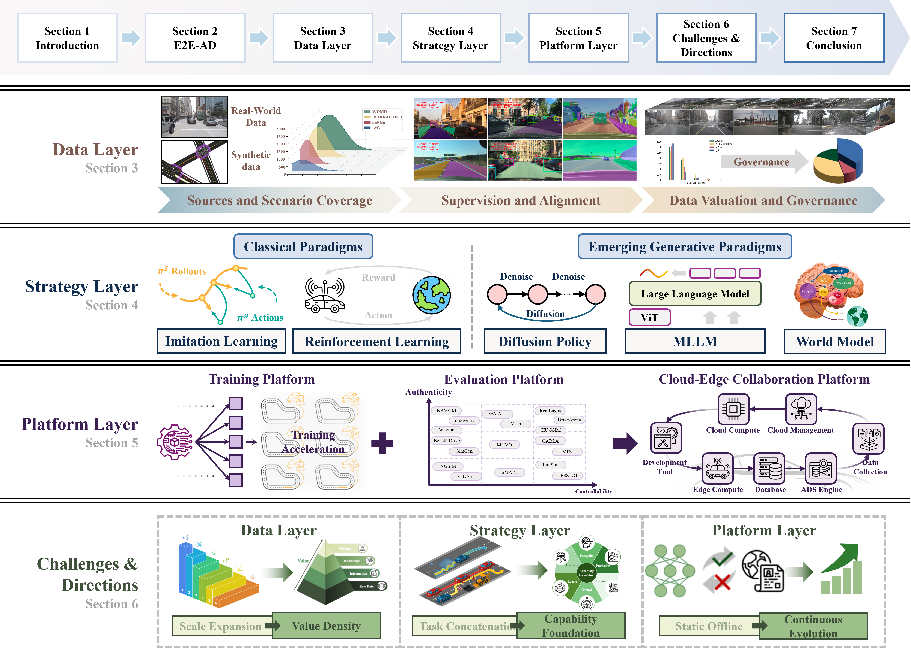

<h1 align="center">
  <strong>A Survey on End-to-End Autonomous Driving Training from the Perspectives of Data, Strategy, and Platform</strong>
</h1>

<div align="center">

[](https://www.techrxiv.org/doi/full/10.36227/techrxiv.176523171.14650662)
[](https://github.com/Jiaaqiliu/Awesome-Training-Ecosystem-for-E2E-AD/pulls)
[](https://star-history.com/#Jiaaqiliu/Awesome-Training-Ecosystem-for-E2E-AD)
[](LICENSE)

</div>

Welcome to this curated collection of papers on **End-to-End Autonomous Driving (E2E-AD)**, aimed at researchers, engineers, and enthusiasts in the field of autonomous driving systems. This repository provides a comprehensive selection of papers, focusing primarily on the training methods and ecosystems that drive the development of intelligent autonomous vehicles.

In particular, we focus on the **Data-Strategy-Platform** framework for E2E-AD systems, offering insights into:

- **Data Layer**: Addressing data collection, coverage, and governance practices.
- **Strategy Layer**: Exploring imitation learning, reinforcement learning, and generative approaches.
- **Platform Layer**: Understanding scalable training infrastructures and cloud-edge collaborations.

Each paper in this repository has been selected for its relevance and contribution to the field, and we hope it serves as a valuable resource for anyone working in or learning about autonomous driving technology.

---

## 📰 News

<div align="center">

<table>
  <tr>
    <td align="center"><strong>🎉 2026.05.20</strong></td>
    <td>Our survey was accepted by <strong>IEEE Transactions on Intelligent Transportation Systems (TITS)</strong>.</td>
  </tr>
  <tr>
    <td align="center"><strong>🔄 2026.05.22</strong></td>
    <td>Repository updated with the latest E2E-AD training ecosystem papers and resources.</td>
  </tr>
</table>
</div>


---

<div align="center">

### 🤝 Contributions Are Welcome

We warmly welcome pull requests and suggestions for adding new papers, benchmarks, datasets, and useful resources.

If you find this repository helpful, please consider **citing our survey**, **starring this repository ⭐**, and sharing it with the community.

</div>

---


## 📌 Framework

<div align="center">

</div>


## Table of Contents

- [Survey paper](#survey-paper)
- [Research Papers](#research-papers) 
  - [Data Layer](#data-layer)
    - [Sources and Scenario Coverage](#Sources-and-Scenario-Coverage)
    - [Supervision and Alignment of Labels](#Supervision-and-Alignment-of-Labels)
    - [Data Valuation and Governance](#Data-Valuation-and-Governance)
  - [Strategy Layer](#strategy-layer)
    - [Imitation Learning](#Imitation-Learning)
    - [Reinforcement Learning](#Reinforcement-Learning)
    - [Diffusion Policy](#Diffusion-Policy)
    - [Multimodal Large Language Model](#Multimodal-Large-Language-Model)
    - [World Model](#World-Model)
  - [Platform Layer](#platform-layer)
    - [Distributed and Parallel Training Platform](#Distributed-and-Parallel-Training-Platform)
    - [Testing and Evaluation Platform](#Testing-and-Evaluation-Platform)
- [Datasets & Benchmarks](#Datasets-&-Benchmarks)
- [Other Awesome Lists](#Other-Awesome-Lists)
- [Citation](#Citation)


---

### **📚Survey Papers**

| **Title**                                                    |   **Year**    |    **Categories**     |                         **Project**                          |
| :----------------------------------------------------------- | :-----------: | :-------------------: | :----------------------------------------------------------: |
| [End-to-end Autonomous Driving: Challenges and Frontiers](https://ieeexplore.ieee.org/abstract/document/10614862) |  TPAMI 2025   |      End to End       | [Project](https://github.com/OpenDriveLab/End-to-end-Autonomous-Driving) |
| [A Survey of World Models for Autonomous Driving](https://arxiv.org/abs/2501.11260) |  arXiv 2025   |      World Model      | [Project](https://github.com/FengZicai/AwesomeWMAD) / [Benchmark](https://github.com/FengZicai/WMAD-Benchmarks) |
| [Generative AI for Autonomous Driving: Frontiers and Opportunities](https://arxiv.org/abs/2505.08854) |  arXiv 2025   |     Generative AI     |      [Project](https://github.com/taco-group/GenAI4AD)       |
| [A Survey on Vision-Language-Action Models for Autonomous Driving](https://arxiv.org/abs/2506.24044) |  arXiv 2025   | Vision-Language-Action | [Project](https://github.com/JohnsonJiang1996/Awesome-VLA4AD) |
| [World models for autonomous driving: An initial survey](https://ieeexplore.ieee.org/abstract/document/10522953/) |   TIV 2024    |      World Model      |                                                              |
| [Synthetic datasets for autonomous driving: A survey](https://ieeexplore.ieee.org/abstract/document/10313052/) |   TIV 2023    |       Datasets        |                                                              |
| [Explainable AI for safe and trustworthy autonomous driving: A systematic review](https://ieeexplore.ieee.org/abstract/document/10716567/) |   TITS 2024   |          XAI          |                                                              |
| [On the Prospects of Incorporating Large Language Models (LLMs) in Automated Planning and Scheduling](https://ojs.aaai.org/index.php/ICAPS/article/view/31503) |  ICAPS 2024   | Large Language Models |  [Project](https://ai4society.github.io/LLM-Planning-Viz/)   |
| [Prospective role of foundation models in advancing autonomous vehicles](https://spj.science.org/doi/full/10.34133/research.0399) | Research 2024 |   Foundation Models   |                                                              |
| [Large models for intelligent transportation systems and autonomous vehicles: A survey](https://www.sciencedirect.com/science/article/pii/S1474034624004348) |   AEI 2024    |   Foundation Models   |                                                              |
| [Vision language models in autonomous driving: A survey and outlook](https://ieeexplore.ieee.org/abstract/document/10531702/) |    IV 2024    |   Foundation Models   |   [Project](https://github.com/ge25nab/Awesome-VLM-AD-ITS)   |
| [A Survey on Multimodal Large Language Models for Autonomous Driving](https://openaccess.thecvf.com/content/WACV2024W/LLVM-AD/html/Cui_A_Survey_on_Multimodal_Large_Language_Models_for_Autonomous_Driving_WACVW_2024_paper.html) |   WACV 2024   |   Foundation Models   |                                                              |
| [A survey for foundation models in autonomous driving](https://arxiv.org/abs/2402.01105) |  arXiv 2024   |   Foundation Models   |                                                              |
| [Forging Vision Foundation Models for Autonomous Driving: Challenges, Methodologies, and Opportunities](https://arxiv.org/abs/2401.08045) |  arXiv 2024   |   Foundation Models   |                                                              |
| [Llm4drive: A survey of large language models for autonomous driving](https://arxiv.org/abs/2311.01043) |  arXiv 2023   | Large Language Models |  [Project](https://github.com/Thinklab-SJTU/Awesome-LLM4AD)  |
| [V2X cooperative perception for autonomous driving: Recent advances and challenges](https://arxiv.org/abs/2310.03525) |  arXiv 2023   |       Datasets        |                                                              |
| [Learning-based 3D Reconstruction in Autonomous Driving: A Comprehensive Survey](https://arxiv.org/abs/2503.14537) |  arXiv 2025   |       Datasets        |                                                              |


---

### **📄Research Papers**

### **Data Layer**

#### **Sources and Scenario Coverage**

| Title                                                        | Abstract                                       | Year       | Project                                                      |
| ------------------------------------------------------------ | ---------------------------------------------- | ---------- | ------------------------------------------------------------ |
| [Closed Loop Dynamic Driving Data Mixture for Real-Synthetic Co-Training](https://arxiv.org/abs/2605.21372) | <details><summary>Details</summary> Proposes AutoScale, a closed-loop data engine that optimizes real-synthetic driving data mixtures with scene representations, cluster reweighting, retrieval, training, and evaluation feedback. </details> | arXiv 2026 |                                                              |
| [4DLidarOpen: An Open 4D FMCW Lidar Dataset for Motion-Aware Autonomous Driving](https://arxiv.org/abs/2605.18074) | <details><summary>Details</summary> Introduces a multi-modal 4D FMCW LiDAR dataset with point-wise velocity, multi-LiDAR and camera streams, 3D boxes, tracks, and benchmarks for detection, BEV flow, forecasting, and planning. </details> | arXiv 2026 |                                                              |
| [XWOD: A Real-World Benchmark for Object Detection under Extreme Weather Conditions](https://arxiv.org/abs/2605.11521) | <details><summary>Details</summary> Builds an extreme-weather object-detection benchmark with real traffic images across rain, snow, fog, flooding, tornado, wildfire, and other adverse conditions. </details> | arXiv 2026 |                                                              |
| [ScenePilot-Bench: A Large-Scale Dataset and Benchmark for Evaluation of Vision-Language Models in Autonomous Driving](https://arxiv.org/abs/2601.19582) | <details><summary>Details</summary> Provides a first-person driving VLM benchmark built on ScenePilot-4K, evaluating scene understanding, spatial perception, motion planning, safety reasoning, and regional generalization. </details> | arXiv 2026 | [Dataset](https://huggingface.co/datasets/larswangtj/ScenePilot-4K) |
| [VR-Drive: Viewpoint-Robust End-to-End Driving with Feed-Forward 3D Gaussian Splatting](https://vrdriveneurips.github.io/) | <details><summary>Details</summary> Uses feed-forward 3D Gaussian Splatting to synthesize viewpoint-robust driving observations, improving end-to-end policy robustness under camera pose and viewpoint changes. </details> | NeurIPS 2025 | [Project](https://vrdriveneurips.github.io/)                 |
| [WOD-E2E: Waymo Open Dataset for End-to-End Driving in Challenging Long-tail Scenarios](https://arxiv.org/abs/2510.26125) | <details><summary>Details</summary> Adapts Waymo Open Dataset into an end-to-end driving benchmark emphasizing challenging long-tail scenes for planning-oriented policy evaluation. </details> | arXiv 2025 | [Project](https://waymo.com/intl/jp/open/data/e2e/)          |
| [SimScale: Learning to Drive via Real-World Simulation at Scale](https://arxiv.org/abs/2511.23369) | <details><summary>Details</summary> Scales real-world simulation for closed-loop end-to-end driving by converting large-scale logs into interactive training environments for policy learning and evaluation. </details> | CVPR 2026 Oral | [Project](https://opendrivelab.com/SimScale/) / [Code](https://github.com/OpenDriveLab/SimScale) |
| [SynAD: Enhancing Real-World End-to-End Autonomous Driving Models through Synthetic Data](https://openaccess.thecvf.com/content/ICCV2025/html/Kim_SynAD_Enhancing_Real-World_End-to-End_Autonomous_Driving_Models_through_Synthetic_Data_ICCV_2025_paper.html) | <details><summary>Details</summary> Studies synthetic-data augmentation for real-world end-to-end driving models, targeting better robustness and generalization under data scarcity and long-tail scenarios. </details> | ICCV 2025  |                                                              |
| [CoVLA: Comprehensive Vision-Language-Action Dataset for Autonomous Driving](https://openaccess.thecvf.com/content/WACV2025/papers/Arai_CoVLA_Comprehensive_Vision-Language-Action_Dataset_for_Autonomous_Driving_WACV_2025_paper.pdf) | <details><summary>Details</summary> </details> | WACV 2025  | [Project](https://turingmotors.github.io/covla-ad/)          |
| [Argoverse 2: Next generation datasets for self-driving perception and forecasting](https://arxiv.org/abs/2301.00493) | <details><summary>Details</summary> </details> | arXiv 2023 | [Project](https://www.argoverse.org/av2.html)                |
| [WOMD-Reasoning: A Large-Scale Dataset for Interaction Reasoning in Driving](https://arxiv.org/abs/2407.04281) | <details><summary>Details</summary> </details> | ICML 2025  | [Code](https://github.com/yhli123/WOMD-Reasoning) / [Project](https://waymo.com/open/download) |
| [nuscenes: A multimodal dataset for autonomous driving](http://openaccess.thecvf.com/content_CVPR_2020/html/Caesar_nuScenes_A_Multimodal_Dataset_for_Autonomous_Driving_CVPR_2020_paper.html) | <details><summary>Details</summary> </details> | CVPR 2020  | [Project](https://www.nuscenes.org/)                         |
| [One million scenes for autonomous driving: Once dataset](https://arxiv.org/abs/2106.11037) | <details><summary>Details</summary> </details> | arXiv 2021 | [Project](https://once-for-auto-driving.github.io/index.html) |
| [Scalability in perception for autonomous driving: Waymo open dataset](http://openaccess.thecvf.com/content_CVPR_2020/html/Sun_Scalability_in_Perception_for_Autonomous_Driving_Waymo_Open_Dataset_CVPR_2020_paper.html) | <details><summary>Details</summary> Introduces the Waymo Open Dataset for scalable autonomous-driving perception research, including synchronized LiDAR, camera, labels, and benchmarks for detection and tracking. </details> | CVPR 2020  | [Project](https://waymo.com/open/)                           |
| [Zenseact Open Dataset: A Large-Scale and Diverse Multimodal Dataset for Autonomous Driving](http://openaccess.thecvf.com/content/ICCV2023/html/Alibeigi_Zenseact_Open_Dataset_A_Large-Scale_and_Diverse_Multimodal_Dataset_for_ICCV_2023_paper.html) | <details><summary>Details</summary> Introduces a large-scale multimodal autonomous-driving dataset with diverse European driving scenes and annotations for perception, prediction, and planning research. </details> | ICCV 2023  | [Project](https://zod.zenseact.com/)                         |
| [Scaling out-of-distribution detection for real-world settings](https://arxiv.org/abs/1911.11132) | <details><summary>Details</summary> </details> | PMLR 2022  | [Code](https://github.com/hendrycks/anomaly-seg)             |
| [SHIFT: a synthetic driving dataset for continuous multi-task domain adaptation](http://openaccess.thecvf.com/content/CVPR2022/html/Sun_SHIFT_A_Synthetic_Driving_Dataset_for_Continuous_Multi-Task_Domain_Adaptation_CVPR_2022_paper.html) | <details><summary>Details</summary> Introduces a synthetic driving dataset for continuous domain adaptation across weather, time, and scene changes, supporting multiple perception tasks. </details> | CVPR 2022  | [Project](https://www.vis.xyz/shift)                         |
| [V2x-vit: Vehicle-to-everything cooperative perception with vision transformer](https://link.springer.com/chapter/10.1007/978-3-031-19842-7_7) | <details><summary>Details</summary> </details> | ECCV 2022  | [Code](https://github.com/DerrickXuNu/v2x-vit)               |
| [Deepaccident: A motion and accident prediction benchmark for v2x autonomous driving](https://ojs.aaai.org/index.php/AAAI/article/view/28370) | <details><summary>Details</summary> Provides a V2X benchmark for accident and motion prediction, focusing on safety-critical cooperative driving scenarios. </details> | AAAI 2024  |                                                              |
| [Bdd100k: A diverse driving dataset for heterogeneous multitask learning](http://openaccess.thecvf.com/content_CVPR_2020/html/Yu_BDD100K_A_Diverse_Driving_Dataset_for_Heterogeneous_Multitask_Learning_CVPR_2020_paper.html) | <details><summary>Details</summary> </details> | CVPR 2020  | [Project](https://bair.berkeley.edu/blog/2018/05/30/bdd/)    |
| [The apolloscape dataset for autonomous driving](https://openaccess.thecvf.com/content_cvpr_2018_workshops/w14/html/Huang_The_ApolloScape_Dataset_CVPR_2018_paper.html?ref=https://githubhelp.com) | <details><summary>Details</summary> </details> | CVPR 2018  | [Project](https://apolloscape.auto/)                         |
| [Tumtraf v2x cooperative perception dataset](http://openaccess.thecvf.com/content/CVPR2024/html/Zimmer_TUMTraf_V2X_Cooperative_Perception_Dataset_CVPR_2024_paper.html) | <details><summary>Details</summary> </details> | CVPR 2024  | [Project](https://tum-traffic-dataset.github.io/tumtraf-v2x/) |
| [Tumtraf intersection dataset: All you need for urban 3d camera-lidar roadside perception](https://ieeexplore.ieee.org/abstract/document/10422289/) | <details><summary>Details</summary> Presents an urban roadside camera-LiDAR dataset for 3D perception at intersections, supporting infrastructure-side cooperative perception research. </details> | ITSC 2023  | [Code](https://github.com/tum-traffic-dataset/tum-traffic-dataset-dev-kit) / [Project](https://innovation-mobility.com/en/project-providentia/a9-dataset/) |
| [V2v4real: A real-world large-scale dataset for vehicle-to-vehicle cooperative perception](http://openaccess.thecvf.com/content/CVPR2023/html/Xu_V2V4Real_A_Real-World_Large-Scale_Dataset_for_Vehicle-to-Vehicle_Cooperative_Perception_CVPR_2023_paper.html) | <details><summary>Details</summary> Introduces a real-world V2V cooperative perception dataset with synchronized multi-vehicle sensing for studying collaboration under realistic communication and viewpoint constraints. </details> | CVPR 2023  | [Project](https://mobility-lab.seas.ucla.edu/v2v4real/)      |
| [Rope3d: The roadside perception dataset for autonomous driving and monocular 3d object detection task](http://openaccess.thecvf.com/content/CVPR2022/html/Ye_Rope3D_The_Roadside_Perception_Dataset_for_Autonomous_Driving_and_Monocular_CVPR_2022_paper.html) | <details><summary>Details</summary> </details> | CVPR 2022  | [Project](https://thudair.baai.ac.cn/rope)                   |
| [Cooperative perception for 3D object detection in driving scenarios using infrastructure sensors](https://ieeexplore.ieee.org/abstract/document/9228884/) | <details><summary>Details</summary> </details> | TITS 2020  |                                                              |
| [Lumpi: The leibniz university multi-perspective intersection dataset](https://ieeexplore.ieee.org/abstract/document/9827157/) | <details><summary>Details</summary> </details> | IV 2022    | [Project](https://data.uni-hannover.de/cs_CZ/dataset/lumpi)  |
| [An automated driving systems data acquisition and analytics platform](https://www.sciencedirect.com/science/article/pii/S0968090X23001092) | <details><summary>Details</summary> </details> | TRC 2023   |                                                              |
| [S-nerf++: Autonomous driving simulation via neural reconstruction and generation](https://ieeexplore.ieee.org/abstract/document/10891659/) | <details><summary>Details</summary> </details> | TPAMI 2025 | [Code](https://github.com/fudan-zvg/S-NeRF)                  |
| [ReconDreamer: Crafting World Models for Driving Scene Reconstruction via Online Restoration](https://openaccess.thecvf.com/content/CVPR2025/html/Ni_ReconDreamer_Crafting_World_Models_for_Driving_Scene_Reconstruction_via_Online_CVPR_2025_paper.html) | <details><summary>Details</summary> Builds driving world models for scene reconstruction through online restoration, improving reconstruction quality and temporal consistency for simulation and data generation. </details> | CVPR 2025  |                                                              |
| [Scene reconstruction techniques for autonomous driving: a review of 3D Gaussian splatting](https://link.springer.com/article/10.1007/s10462-024-10955-4) | <details><summary>Details</summary> </details> | AIR        |                                                              |
| [Driving into the future: Multiview visual forecasting and planning with world model for autonomous driving](https://openaccess.thecvf.com/content/CVPR2024/html/Wang_Driving_into_the_Future_Multiview_Visual_Forecasting_and_Planning_with_CVPR_2024_paper.html) | <details><summary>Details</summary> </details> | CVPR 2024  | [Code](https://github.com/BraveGroup/Drive-WM) / [Project](https://drive-wm.github.io/) |
| [Scenecontrol: Diffusion for controllable traffic scene generation](https://ieeexplore.ieee.org/abstract/document/10610324/) | <details><summary>Details</summary> </details> | ICRA 2024  |                                                              |
| [Diffscene: Diffusion-based safety-critical scenario generation for autonomous vehicles](https://ojs.aaai.org/index.php/AAAI/article/view/32951) | <details><summary>Details</summary> </details> | AAAI 2025  |                                                              |
| [Simulation-based reinforcement learning for real-world autonomous driving](https://ieeexplore.ieee.org/abstract/document/9196730/) | <details><summary>Details</summary> </details> | ICRA 2020  |                                                              |

#### **Supervision and Alignment of Labels**

| Title                                                        | Abstract                                       | Year         | Project                                                    |
| ------------------------------------------------------------ | ---------------------------------------------- | ------------ | ---------------------------------------------------------- |
| [Openannotate2: Multi-modal auto-annotating for autonomous driving](https://ieeexplore.ieee.org/abstract/document/10480248/) | <details><summary>Details</summary> </details> | TIV 2024     | [Code](https://github.com/Fudan-ProjectTitan/OpenAnnotate) |
| [Masked-attention mask transformer for universal image segmentation](http://openaccess.thecvf.com/content/CVPR2022/html/Cheng_Masked-Attention_Mask_Transformer_for_Universal_Image_Segmentation_CVPR_2022_paper.html) | <details><summary>Details</summary> </details> | CVPR 2022    | [Code](https://github.com/facebookresearch/Mask2Former)    |
| [Per-pixel classification is not all you need for semantic segmentation](https://proceedings.neurips.cc/paper/2021/hash/950a4152c2b4aa3ad78bdd6b366cc179-Abstract.html) | <details><summary>Details</summary> </details> | NeurIPS 2021 |                                                            |
| [Automatic model-based dataset generation for high-level vision tasks of autonomous driving in haze weather](https://ieeexplore.ieee.org/abstract/document/9964250/) | <details><summary>Details</summary> </details> | TII 2022     |                                                            |
| [Learning to Drive Anywhere with Model-Based Reannotation](https://arxiv.org/abs/2505.05592) | <details><summary>Details</summary> </details> | arXiv 2025   |                                                            |
| [Proximity based automatic data annotation for autonomous driving](https://ieeexplore.ieee.org/abstract/document/9016395/) | <details><summary>Details</summary> </details> | JAS 2020     |                                                            |
| [Towards a weakly supervised framework for 3D point cloud object detection and annotation](https://ieeexplore.ieee.org/abstract/document/9369074/) | <details><summary>Details</summary> </details> | TPAMI 2021   |                                                            |
| [DrivingDiffusion: layout-guided multi-view driving scenarios video generation with latent diffusion model](https://link.springer.com/chapter/10.1007/978-3-031-73229-4_27) | <details><summary>Details</summary> </details> | ECCV 2024    |                                                            |
| [Adaptive fusion of single-view and multi-view depth for autonomous driving](http://openaccess.thecvf.com/content/CVPR2024/html/Cheng_Adaptive_Fusion_of_Single-View_and_Multi-View_Depth_for_Autonomous_Driving_CVPR_2024_paper.html) | <details><summary>Details</summary> </details> | CVPR 2024    | [Project](https://github.com/Junda24/AFNet/)               |
| [Image-to-lidar self-supervised distillation for autonomous driving data](http://openaccess.thecvf.com/content/CVPR2022/html/Sautier_Image-to-Lidar_Self-Supervised_Distillation_for_Autonomous_Driving_Data_CVPR_2022_paper.html) | <details><summary>Details</summary> </details> | CVPR 2022    | [Code](https://github.com/valeoai/SLidR)                   |
| [A simple vision transformer for weakly semi-supervised 3d object detection](http://openaccess.thecvf.com/content/ICCV2023/html/Zhang_A_Simple_Vision_Transformer_for_Weakly_Semi-supervised_3D_Object_Detection_ICCV_2023_paper.html) | <details><summary>Details</summary> </details> | ICCV 2023    |                                                            |
| [Active learning of driving scenario trajectories](https://www.sciencedirect.com/science/article/pii/S0952197622001750) | <details><summary>Details</summary> </details> | EAAI 2022    |                                                            |

#### **Data Valuation and Governance**

| Title                                                        | Abstract                                       | Year          | Project                                                |
| ------------------------------------------------------------ | ---------------------------------------------- | ------------- | ------------------------------------------------------ |
| [ScenePilot: Controllable Boundary-Driven Critical Scenario Generation for Autonomous Driving](https://arxiv.org/abs/2605.21168) | <details><summary>Details</summary> Generates controllable safety-critical driving scenarios by modeling boundary conditions, enabling targeted stress testing for autonomous-driving policies. </details> | arXiv 2026    |                                                        |
| [Guiding Neuro-Symbolic Scenario Generation with Spatio-Temporal Logic](https://arxiv.org/abs/2605.19038) | <details><summary>Details</summary> Combines neural generation with spatio-temporal logic constraints to synthesize driving scenarios that satisfy explicit temporal and safety specifications. </details> | arXiv 2026    |                                                        |
| [Learning Responsibility-Attributed Adversarial Scenarios for Testing Autonomous Vehicles](https://arxiv.org/abs/2605.13751) | <details><summary>Details</summary> Constructs adversarial testing scenarios with responsibility attribution, helping diagnose which agents or interactions induce autonomous-driving failures. </details> | arXiv 2026    |                                                        |
| [PCASim: Promptable Closed-loop Adversarial Simulation for Urban Traffic Environment](https://arxiv.org/abs/2605.15654) | <details><summary>Details</summary> Introduces a promptable closed-loop adversarial simulator for urban traffic, enabling language-guided generation of challenging test cases. </details> | arXiv 2026    |                                                        |
| [Diversified Critical-Scenario-Search for Defect Detection of Autonomous Driving System](https://ieeexplore.ieee.org/abstract/document/10557770/) | <details><summary>Details</summary> </details> | TIV 2024      |                                                        |
| [Boosting offline reinforcement learning for autonomous driving with hierarchical latent skills](https://ieeexplore.ieee.org/abstract/document/10611197/) | <details><summary>Details</summary> </details> | ICRA 2024     |                                                        |
| [A scenario distribution model for effective and efficient testing of autonomous driving systems](https://dl.acm.org/doi/abs/10.1145/3551349.3563239) | <details><summary>Details</summary> </details> | ASE 2022      |                                                        |
| [Did we test all scenarios for automated and autonomous driving systems?](https://ieeexplore.ieee.org/abstract/document/8917326/) | <details><summary>Details</summary> </details> | ITSC 2019     |                                                        |
| [Steerable Adversarial Scenario Generation through Test-Time Preference Alignment](https://arxiv.org/abs/2509.20102) | <details><summary>Details</summary> </details> | arXiv 2025    | [Project](https://tongnie.github.io/SAGE/)             |
| [Llm-attacker: Enhancing closed-loop adversarial scenario generation for autonomous driving with large language models](https://arxiv.org/abs/2501.15850) | <details><summary>Details</summary> </details> | arXiv 2025    |                                                        |
| [Embedding synthetic off-policy experience for autonomous driving via zero-shot curricula](https://proceedings.mlr.press/v205/bronstein23a.html) | <details><summary>Details</summary> </details> | CRL 2023      |                                                        |
| [Quantitative representation of autonomous driving scenario difficulty based on adversarial policy search](https://spj.science.org/doi/full/10.34133/research.0575) | <details><summary>Details</summary> </details> | Research 2025 | [Project](https://www.youtube.com/watch?v=GceGdqAm9Ys) |
| [King: Generating safety-critical driving scenarios for robust imitation via kinematics gradients](https://link.springer.com/chapter/10.1007/978-3-031-19839-7_20) | <details><summary>Details</summary> </details> | ECCV 2022     |                                                        |
| [Mitigating bias of deep neural networks for trustworthy traffic perception in autonomous systems](https://ieeexplore.ieee.org/abstract/document/10588805/) | <details><summary>Details</summary> </details> | IV 2024       |                                                        |
| [Privacy-preserved federated learning for autonomous driving](https://ieeexplore.ieee.org/abstract/document/9457207/) | <details><summary>Details</summary> </details> | TITS 2021     |                                                        |
| [ADD: An automatic desensitization fisheye dataset for autonomous driving](https://www.sciencedirect.com/science/article/pii/S0952197623009508) | <details><summary>Details</summary> </details> | EAAI 2023     |                                                        |
| [Federated vehicular transformers and their federations: Privacy-preserving computing and cooperation for autonomous driving](https://ieeexplore.ieee.org/abstract/document/9857660/) | <details><summary>Details</summary> </details> | TIV 2022      |                                                        |

---

### Strategy Layer

#### **Imitation Learning**

| Title                                                        | Abstract                                       | Year       | Project                                                      |
| ------------------------------------------------------------ | ---------------------------------------------- | ---------- | ------------------------------------------------------------ |
| [CLOVER: Closed-Loop Value Estimation & Ranking for End-to-End Autonomous Driving Planning](https://arxiv.org/abs/2605.15120) | <details><summary>Details</summary> Ranks candidate plans with closed-loop value estimation, improving planning selection by considering downstream interactive outcomes rather than only open-loop trajectory error. </details> | arXiv 2026 | [Code](https://github.com/WilliamXuanYu/CLOVER)              |
| [Beyond Imitation: Learning Safe End-to-End Autonomous Driving from Hard Negatives](https://arxiv.org/abs/2605.19771) | <details><summary>Details</summary> Improves imitation-based driving by mining hard negative behaviors and training the policy to avoid unsafe actions in challenging scenarios. </details> | arXiv 2026 |                                                              |
| [Causality-Aware End-to-End Autonomous Driving via Ego-Centric Joint Scene Modeling](https://arxiv.org/abs/2605.13646) | <details><summary>Details</summary> Models ego-centric scene causality jointly with driving policy learning, aiming to separate causal factors from spurious correlations for safer end-to-end planning. </details> | arXiv 2026 |                                                              |
| [Temporal Sampling Frequency Matters: A Capacity-Aware Study of End-to-End Driving Trajectory Prediction](https://arxiv.org/abs/2605.10388) | <details><summary>Details</summary> Analyzes how temporal sampling frequency interacts with model capacity in trajectory prediction, offering guidance for data construction and policy training. </details> | arXiv 2026 |                                                              |
| [Future-Aware End-to-End Driving: Bidirectional Modeling of Trajectory Planning and Scene Evolution](https://proceedings.neurips.cc/paper_files/paper/2025/hash/0ee633a6ade45eab4276352b3ee79c7a-Abstract-Conference.html) | <details><summary>Details</summary> Jointly models future scene evolution and ego trajectory planning, using bidirectional interactions between prediction and planning to improve driving decisions. </details> | NeurIPS 2025 | [Code](https://github.com/LogosRoboticsGroup/SeerDrive)      |
| [Perception in Plan: Coupled Perception and Planning for End-to-End Autonomous Driving](https://ojs.aaai.org/index.php/AAAI/article/view/38230) | <details><summary>Details</summary> Couples perception and planning in a single end-to-end framework so planning supervision can shape perception features toward driving-relevant scene understanding. </details> | AAAI 2026  |                                                              |
| [Bridging Past and Future: End-to-End Autonomous Driving with Historical Prediction and Planning](https://openaccess.thecvf.com/content/CVPR2025/html/Zhang_Bridging_Past_and_Future_End-to-End_Autonomous_Driving_with_Historical_Prediction_CVPR_2025_paper.html) | <details><summary>Details</summary> Uses historical prediction and future planning jointly, bridging temporal context and planning targets for stronger end-to-end driving performance. </details> | CVPR 2025  | [Code](https://github.com/fudan-zvg/BridgeAD)                |
| [Don't Shake the Wheel: Momentum-Aware Planning in End-to-End Autonomous Driving](https://openaccess.thecvf.com/content/CVPR2025/html/Song_Dont_Shake_the_Wheel_Momentum-Aware_Planning_in_End-to-End_Autonomous_Driving_CVPR_2025_paper.html) | <details><summary>Details</summary> Introduces momentum-aware planning to reduce unstable steering and improve trajectory smoothness while preserving planning accuracy. </details> | CVPR 2025  | [Code](https://github.com/adept-thu/MomAD)                   |
| [Planning-oriented autonomous driving](http://openaccess.thecvf.com/content/CVPR2023/html/Hu_Planning-Oriented_Autonomous_Driving_CVPR_2023_paper.html) | <details><summary>Details</summary> </details> | CVPR 2023  | [Code](https://github.com/OpenDriveLab/UniAD)                |
| [Transfuser: Imitation with transformer-based sensor fusion for autonomous driving](https://ieeexplore.ieee.org/abstract/document/9863660/) | <details><summary>Details</summary> </details> | TPAMI 2022 | [Code](https://github.com/autonomousvision/transfuser.git)   |
| [Safety-enhanced autonomous driving using interpretable sensor fusion transformer](https://proceedings.mlr.press/v205/shao23a.html) | <details><summary>Details</summary> </details> | CoRL 2022  | [Code](https://github.com/opendilab/InterFuser)              |
| [Reasonnet: End-to-end driving with temporal and global reasoning](http://openaccess.thecvf.com/content/CVPR2023/html/Shao_ReasonNet_End-to-End_Driving_With_Temporal_and_Global_Reasoning_CVPR_2023_paper.html) | <details><summary>Details</summary> </details> | CVPR 2023  | [Code](https://github.com/opendilab/DOS)                     |
| [Ppad: Iterative interactions of prediction and planning for end-to-end autonomous driving](https://link.springer.com/chapter/10.1007/978-3-031-72761-0_14) | <details><summary>Details</summary> </details> | ECCV 2024  | [Code](https://github.com/zlichen/PPAD)                      |
| [Multi-modal fusion transformer for end-to-end autonomous driving](http://openaccess.thecvf.com/content/CVPR2021/html/Prakash_Multi-Modal_Fusion_Transformer_for_End-to-End_Autonomous_Driving_CVPR_2021_paper.html) | <details><summary>Details</summary> </details> | CVPR 2021  | [Code](https://github.com/autonomousvision/transfuser.git)   |
| [Think twice before driving: Towards scalable decoders for end-to-end autonomous driving](http://openaccess.thecvf.com/content/CVPR2023/html/Jia_Think_Twice_Before_Driving_Towards_Scalable_Decoders_for_End-to-End_Autonomous_CVPR_2023_paper.html) | <details><summary>Details</summary> </details> | CVPR 2023  | [Code](https://github.com/OpenDriveLab/ThinkTwice)           |
| [Learning from all vehicles](http://openaccess.thecvf.com/content/CVPR2022/html/Chen_Learning_From_All_Vehicles_CVPR_2022_paper.html) | <details><summary>Details</summary> </details> | CVPR 2022  | [Code](https://github.com/dotchen/LAV.git)                   |
| [Neat: Neural attention fields for end-to-end autonomous driving](http://openaccess.thecvf.com/content/ICCV2021/html/Chitta_NEAT_Neural_Attention_Fields_for_End-to-End_Autonomous_Driving_ICCV_2021_paper.html) | <details><summary>Details</summary> </details> | ICCV 2021  | [Code](https://github.com/autonomousvision/neat.git)         |
| [Learning to steer by mimicking features from heterogeneous auxiliary networks](https://aaai.org/ojs/index.php/AAAI/article/view/4859) | <details><summary>Details</summary> </details> | AAAI 2019  | [Code](https://github.com/cardwing/Codes-for-Steering-Control.git) |
| [Driving on Registers](https://arxiv.org/html/2601.05083v1)  | <details><summary>Details</summary> Investigates register-like internal representations for end-to-end driving, improving how models store and use scene context for planning. </details> | arXiv 2026 |                                                              |


#### **Reinforcement Learning**

| Title                                                        | Abstract                                                     | Year       | Project                                                      |
| ------------------------------------------------------------ | ------------------------------------------------------------ | ---------- | ------------------------------------------------------------ |
| [Distill to Think, Foresee to Act: Cognitive-Physical Reinforcement Learning for Autonomous Driving](https://arxiv.org/abs/2605.21139) | <details><summary>Details</summary> Combines cognitive reasoning distillation with physical action learning, using reinforcement learning to align high-level foresight with low-level control. </details> | arXiv 2026 |                                                              |
| [MAPLE: Latent Multi-Agent Play for End-to-End Autonomous Driving](https://arxiv.org/abs/2605.14201) | <details><summary>Details</summary> Introduces latent multi-agent play to train end-to-end driving policies against interactive agents, improving robustness in socially complex traffic. </details> | arXiv 2026 |                                                              |
| [MTA-RL: Robust Urban Driving via Multi-modal Transformer-based 3D Affordances and Reinforcement Learning](https://arxiv.org/abs/2605.10177) | <details><summary>Details</summary> Uses transformer-based 3D affordance representations with reinforcement learning to improve robust urban driving under multi-modal sensory inputs. </details> | arXiv 2026 |                                                              |
| [DriveDPO: Policy Learning via Safety DPO For End-to-End Autonomous Driving](https://arxiv.org/abs/2509.17940) | <details><summary>Details</summary> Applies safety-oriented Direct Preference Optimization to end-to-end driving policy learning, aligning planner outputs with safe trajectory preferences. </details> | NeurIPS 2025 |                                                              |
| [RAD: Training an End-to-End Driving Policy via Large-Scale 3DGS-based Reinforcement Learning](https://arxiv.org/abs/2502.13144) | <details><summary>Details</summary> Trains end-to-end driving policies in large-scale 3D Gaussian Splatting environments, using reinforcement learning to bridge realistic simulation and closed-loop driving. </details> | NeurIPS 2025 | [Project](https://hgao-cv.github.io/RAD/) / [Code](https://github.com/hustvl/RAD) |
| [Sim2Real-AD: A Modular Sim-to-Real Framework for Deploying VLM-Guided Reinforcement Learning in Real-World Autonomous Driving](https://arxiv.org/abs/2604.03497) | <details><summary>Details</summary> Builds a modular sim-to-real pipeline for VLM-guided reinforcement learning, targeting deployable autonomous-driving policies beyond simulation. </details> | arXiv 2026 |                                                              |
| [DreamerAD: Efficient Reinforcement Learning via Latent World Model for Autonomous Driving](https://arxiv.org/abs/2603.24587) | <details><summary>Details</summary> Adapts latent world-model reinforcement learning to autonomous driving, reducing environment interaction cost through imagined rollouts. </details> | arXiv 2026 |                                                              |
| [DriveVLM-RL: Neuroscience-Inspired Reinforcement Learning with Vision-Language Models for Safe and Deployable Autonomous Driving](https://arxiv.org/abs/2603.18315) | <details><summary>Details</summary> Uses VLM-derived semantic rewards during offline training through a dual-pathway design, then removes VLM inference at deployment for real-time driving. </details> | arXiv 2026 | [Project](https://zilin-huang.github.io/DriveVLM-RL-website/) |
| [CorrectionPlanner: Self-Correction Planner with Reinforcement Learning in Autonomous Driving](https://arxiv.org/abs/2603.15771) | <details><summary>Details</summary> Models planning as a propose-evaluate-correct loop over motion tokens, using a collision critic and model-based RL to recover from unsafe candidate actions. </details> | arXiv 2026 |                                                              |
| [TADPO: Reinforcement Learning Goes Off-road](https://arxiv.org/abs/2603.04184) | <details><summary>Details</summary> Off-road autonomous driving presents sparse-reward and high-risk exploration challenges; TADPO proposes an RL optimization scheme tailored for off-road robustness and safety trade-offs. </details> | arXiv 2026 |                                                              |
| [ThinkDrive: Chain-of-Thought Guided Progressive Reinforcement Learning Fine-Tuning for Autonomous Driving](https://arxiv.org/abs/2601.04714) | <details><summary>Details</summary> Combines chain-of-thought supervision with progressive reinforcement fine-tuning to align driving reasoning, intent, and trajectory planning. </details> | arXiv 2026 |                                                              |
| [Effective Learning Mechanism Based on Reward-Oriented Hierarchies for Sim-to-Real Adaption in Autonomous Driving Systems](https://ieeexplore.ieee.org/abstract/document/10840284/) | <details><summary>Details</summary> </details>               | TITS 2025  |                                                              |
| [Safe-state enhancement method for autonomous driving via direct hierarchical reinforcement learning](https://ieeexplore.ieee.org/abstract/document/10120651/) | <details><summary>Details</summary> </details>               | TITS 2023  |                                                              |
| [Imitation is not enough: Robustifying imitation with reinforcement learning for challenging driving scenarios](https://ieeexplore.ieee.org/abstract/document/10342038/) | <details><summary>Details</summary> </details>               | IROS 2023  |                                                              |
| [Safe reinforcement learning for autonomous vehicle using monte carlo tree search](https://ieeexplore.ieee.org/abstract/document/9376709/) | <details><summary>Details</summary> </details>               | TITS 2021  |                                                              |
| [Uncertainty-aware model-based reinforcement learning: Methodology and application in autonomous driving](https://ieeexplore.ieee.org/abstract/document/9802913/) | <details><summary>Details</summary> </details>               | TIV 2022   |                                                              |
| [Safety-aware causal representation for trustworthy offline reinforcement learning in autonomous driving](https://ieeexplore.ieee.org/abstract/document/10476686/) | <details><summary>Details</summary> </details>               | RAL 2024   |                                                              |
| [Improving generalization of transfer learning across domains using spatio-temporal features in autonomous driving](https://arxiv.org/abs/2103.08116) | <details><summary>Details</summary> </details>               | arXiv 2021 |                                                              |
| [Towards socially responsive autonomous vehicles: A reinforcement learning framework with driving priors and coordination awareness](https://ieeexplore.ieee.org/abstract/document/10315232/) | <details><summary>Details</summary> </details>               | TIV 2023   |                                                              |
| [Uncertainty-aware model-based offline reinforcement learning for automated driving](https://ieeexplore.ieee.org/abstract/document/10015868/) | <details><summary>Details</summary> </details>               | RAL 2023   |                                                              |
| [Towards safe and robust autonomous vehicle platooning: A self-organizing cooperative control framework](https://arxiv.org/abs/2408.09468) | <details><summary>Details</summary> </details>               | arXiv 2024 | [Project](https://perfectxu88.github.io/towardssafeandrobust.github.io/) |
| [Reinforced Refinement with Self-Aware Expansion for End-to-End Autonomous Driving](https://scholar.google.com/citations?view_op=view_citation&hl=en&user=iizqKUsAAAAJ&sortby=pubdate&citation_for_view=iizqKUsAAAAJ:7PzlFSSx8tAC) | <details><summary>Details</summary> </details>               | TPAMI 2026 |                                                              |


#### **Diffusion Policy**

| Title                                                        | Abstract                                                     | Year       | Project                                                      |
| ------------------------------------------------------------ | ------------------------------------------------------------ | ---------- | ------------------------------------------------------------ |
| [DriveSafer: End-to-End Autonomous Driving with Safety Guidance](https://arxiv.org/abs/2605.16737) | <details><summary>Details</summary> Adds explicit safety guidance to end-to-end driving, steering trajectory generation toward safer behavior in complex traffic scenes. </details>               | arXiv 2026 |                                                              |
| [MISTY: High-Throughput Motion Planning via Mixer-based Single-step Drifting](https://arxiv.org/abs/2604.21489) | <details><summary>Details</summary> Uses mixer-based single-step trajectory generation to accelerate motion planning while preserving multi-modal planning quality. </details>               | arXiv 2026 |                                                              |
| [FeaXDrive: Feasibility-aware Trajectory-Centric Diffusion Planning for End-to-End Autonomous Driving](https://arxiv.org/abs/2604.12656) | <details><summary>Details</summary> Introduces feasibility-aware diffusion planning centered on trajectory generation, improving the physical and driving-rule validity of predicted plans. </details>               | arXiv 2026 |                                                              |
| [RAD-2: Scaling Reinforcement Learning in a Generator-Discriminator Framework](https://arxiv.org/abs/2604.15308) | <details><summary>Details</summary> Scales reinforcement learning with a generator-discriminator framework, targeting stronger policy optimization for autonomous driving. </details>               | arXiv 2026 |                                                              |
| [HAD: Combining Hierarchical Diffusion with Metric-Decoupled RL for End-to-End Driving](https://arxiv.org/abs/2604.03581) | <details><summary>Details</summary> Combines hierarchical diffusion planning with metric-decoupled reinforcement learning to improve safety, comfort, and task progress separately. </details>               | arXiv 2026 |                                                              |
| [Temporally Decoupled Diffusion Planning for Autonomous Driving](https://arxiv.org/abs/2603.25462) | <details><summary>Details</summary> Decouples temporal components in diffusion-based planning, enabling more flexible long-horizon trajectory generation for autonomous driving. </details>               | arXiv 2026 |                                                              |
| [DiffRefiner: Coarse to Fine Trajectory Planning via Diffusion Refinement with Semantic Interaction for End to End Autonomous Driving](https://ojs.aaai.org/index.php/AAAI/article/view/38189) | <details><summary>Details</summary> Refines coarse trajectory proposals through diffusion with semantic interaction modeling, improving fine-grained planning in end-to-end driving. </details>               | AAAI 2026  |                                                              |
| [Driving with Advice: Large Model as Motion Advisor for Joint Planning](https://ojs.aaai.org/index.php/AAAI/article/view/37088) | <details><summary>Details</summary> Uses a large model as a motion advisor to guide joint planning, injecting high-level semantic advice into trajectory generation. </details>               | AAAI 2026  |                                                              |
| [DiffE2E: Rethinking End-to-End Driving with a Hybrid Action Diffusion and Supervised Policy](https://arxiv.org/abs/2505.19516) | <details><summary>Details</summary> Combines action diffusion with supervised policy learning, balancing generative trajectory diversity with stable end-to-end driving behavior. </details>               | NeurIPS 2025 | [Project](https://infinidrive.github.io/DiffE2E/)            |
| [WAM-Flow: Parallel Coarse-to-Fine Motion Planning via Discrete Flow Matching for Autonomous Driving](https://arxiv.org/abs/2512.06112) | <details><summary>Details</summary> Generates future waypoints through parallel coarse-to-fine discrete flow matching and further optimizes closed-loop behavior with simulator-guided rewards. </details>               | CVPR 2026 | [Code](https://github.com/fudan-generative-vision/WAM-Flow)  |
| [Dichotomous Diffusion Policy Optimization](https://arxiv.org/abs/2601.00898) | <details><summary>Details</summary> Proposes DIPOLE, a stable RL method for diffusion policies that decomposes policy improvement into reward-maximizing and reward-minimizing branches, enabling controllable inference and VLA driving experiments on NAVSIM. </details> | ICLR 2026 | [Project](https://lrmbbj.github.io/DIPOLE/) / [Code](https://github.com/DiffusionAD/DIPOLE) |
| [Diffusiondrive: Truncated diffusion model for end-to-end autonomous driving](http://openaccess.thecvf.com/content/CVPR2025/html/Liao_DiffusionDrive_Truncated_Diffusion_Model_for_End-to-End_Autonomous_Driving_CVPR_2025_paper.html) | <details><summary>Details</summary> </details>               | CVPR  2025 | [Code](https://github.com/hustvl/DiffusionDrive)             |
| [Diffvla: Vision-language guided diffusion planning for autonomous driving](https://arxiv.org/abs/2505.19381) | <details><summary>Details</summary> </details>               | arXiv 2025 |                                                              |
| [DiffAD: A Unified Diffusion Modeling Approach for Autonomous Driving](https://arxiv.org/abs/2503.12170) | <details><summary>Details</summary> </details>               | arXiv 2025 |                                                              |
| [A Knowledge-Driven Diffusion Policy for End-to-End Autonomous Driving Based on Expert Routing](https://arxiv.org/abs/2509.04853) | <details><summary>Details</summary> </details>               | arXiv 2025 | [Code](https://github.com/PerfectXu88/KDP-AD) / [Project](https://perfectxu88.github.io/KDP-AD/) |
| [Diffusion-based planning for autonomous driving with flexible guidance](https://arxiv.org/abs/2501.15564) | <details><summary>Details</summary> </details>               | arXiv 2025 |                                                              |
| [Diffusion-ES: Gradient-free planning with diffusion for autonomous and instruction-guided driving](http://openaccess.thecvf.com/content/CVPR2024/html/Yang_Diffusion-ES_Gradient-free_Planning_with_Diffusion_for_Autonomous_and_Instruction-guided_Driving_CVPR_2024_paper.html) | <details><summary>Details</summary> </details>               | CVPR 2024  |                                                              |
| [Uncertainty-Based Alternative Diffusion Policy for Safe Autonomous Driving](https://ieeexplore.ieee.org/abstract/document/11083769/) | <details><summary>Details</summary> </details>               | TITS 2025  |                                                              |
| [Recogdrive: A reinforced cognitive framework for end-to-end autonomous driving](https://arxiv.org/abs/2506.08052) | <details><summary>Details</summary> </details>               | arXiv 2025 |                                                              |
| [FlowDrive: Energy Flow Field for End-to-End Autonomous Driving](https://arxiv.org/abs/2509.14303) | <details><summary>Details</summary> </details>               | arXiv 2025 | [Project](https://astrixdrive.github.io/FlowDrive.github.io/) |
| [Diffusion-based planning for autonomous driving with flexible guidance](https://arxiv.org/abs/2501.15564) | <details><summary>Details</summary> </details>               | arXiv 2025 |                                                              |


#### **Multimodal Large Language Model**

| Title                                                        | Abstract                                                     | Year       | Project                                                      |
| ------------------------------------------------------------ | ------------------------------------------------------------ | ---------- | ------------------------------------------------------------ |
| [Lost in Fog: Sensor Perturbations Expose Reasoning Fragility in Driving VLAs](https://arxiv.org/abs/2605.21446) | <details><summary>Details</summary> Evaluates driving VLA robustness under sensor perturbations such as fog, showing how perception degradation can expose fragile reasoning and planning behavior. </details> | arXiv 2026 |  |
| [SafeAlign-VLA: A Negative-Enhanced Safe Alignment Framework for Risk-Aware Autonomous Driving](https://arxiv.org/abs/2605.19524) | <details><summary>Details</summary> Aligns VLA driving behavior with safety preferences by emphasizing negative examples and risk-aware supervision during training. </details> | arXiv 2026 |  |
| [CLAP: Contrastive Latent-space Prompt Optimization for End-to-end Autonomous Driving](https://arxiv.org/abs/2605.17284) | <details><summary>Details</summary> Optimizes prompts in latent space with contrastive objectives, improving end-to-end driving policy adaptation without heavy model retraining. </details> | arXiv 2026 |  |
| [MindVLA-U1: VLA Beats VA with Unified Streaming Architecture for Autonomous Driving](https://arxiv.org/abs/2605.12624) | <details><summary>Details</summary> Introduces a unified streaming VLA architecture for autonomous driving, integrating perception, language understanding, and action generation in an online setting. </details> | arXiv 2026 |  |
| [OneVL: One-Step Latent Reasoning and Planning with Vision-Language Explanation](https://arxiv.org/abs/2604.18486) | <details><summary>Details</summary> Performs one-step latent reasoning for planning while producing vision-language explanations, reducing multi-step reasoning overhead in VLA driving. </details> | arXiv 2026 | [Project](https://xiaomi-embodied-intelligence.github.io/OneVL) |
| [OneDrive: Unified Multi-Paradigm Driving with Vision-Language-Action Models](https://arxiv.org/abs/2604.17915) | <details><summary>Details</summary> Unifies multiple driving paradigms in a VLA framework, connecting perception, reasoning, and action generation across different supervision modes. </details> | arXiv 2026 | [Code](https://github.com/Z1zyw/OneDrive) |
| [SpanVLA: Efficient Action Bridging and Learning from Negative-Recovery Samples for Vision-Language-Action Model](https://arxiv.org/abs/2604.19710) | <details><summary>Details</summary> Improves VLA driving through efficient action bridging and negative-recovery samples, helping policies learn to recover from unsafe or suboptimal actions. </details> | arXiv 2026 |  |
| [UniDriveVLA: Unifying Understanding, Perception, and Action Planning for Autonomous Driving](https://arxiv.org/abs/2604.02190) | <details><summary>Details</summary> Unifies scene understanding, perception, and action planning in a VLA architecture for end-to-end autonomous driving. </details> | arXiv 2026 | [Code](https://github.com/xiaomi-research/unidrivevla) |
| [ICR-Drive: Instruction Counterfactual Robustness for End-to-End Language-Driven Autonomous Driving](https://arxiv.org/abs/2604.05378) | <details><summary>Details</summary> Evaluates and improves instruction-conditioned driving robustness with counterfactual language and scene perturbations. </details> | arXiv 2026 |  |
| [Vega: Learning to Drive with Natural Language Instructions](https://arxiv.org/abs/2603.25741) | <details><summary>Details</summary> Trains driving policies conditioned on natural language instructions, connecting high-level command following with trajectory-level planning. </details> | arXiv 2026 |  |
| [NoRD: A Data-Efficient Vision-Language-Action Model that Drives without Reasoning](https://arxiv.org/abs/2602.21172) | <details><summary>Details</summary> Shows that a data-efficient VLA policy can drive effectively without explicit chain-of-thought reasoning, reducing inference cost for deployment. </details> | CVPR 2026 | [Project](https://nord-vla-ai.github.io/) |
| [VGGDrive: Empowering Vision-Language Models with Cross-View Geometric Grounding for Autonomous Driving](https://arxiv.org/abs/2602.20794) | <details><summary>Details</summary> Adds cross-view geometric grounding to VLMs, improving spatial understanding and planning reliability in multi-view autonomous driving. </details> | CVPR 2026 | [Project](https://wj-cv.github.io/VGGDrive/) / [Code](https://github.com/WJ-CV/VGGDrive) |
| [FastDriveVLA: Efficient End-to-End Driving via Plug-and-Play Reconstruction-based Token Pruning](https://ojs.aaai.org/index.php/AAAI/article/view/37244) | <details><summary>Details</summary> Proposes ReconPruner, a plug-and-play MAE-style visual token pruner that preserves foreground driving information; introduces nuScenes-FG with 241K image-mask pairs and improves nuScenes open-loop planning across pruning ratios. </details> | AAAI 2026 |  |
| [VLM-AutoDrive: Post-Training Vision-Language Models for Safety-Critical Autonomous Driving Events](https://arxiv.org/abs/2603.18178) | <details><summary>Details</summary> Adapts pretrained VLMs to safety-critical dashcam events with metadata captions, LLM descriptions, VQA pairs, and CoT supervision, improving collision and near-collision detection with interpretable reasoning traces. </details> | arXiv 2026 |  |
| [Senna-2: Aligning VLM and End-to-End Driving Policy for Consistent Decision Making and Planning](https://arxiv.org/abs/2603.11219) | <details><summary>Details</summary> Aligns VLM reasoning with end-to-end policy learning to reduce decision/planning inconsistency and improve reliability in complex driving scenes. </details> | arXiv 2026 |  |
| [SAMoE-VLA: A Scene Adaptive Mixture-of-Experts Vision-Language-Action Model for Autonomous Driving](https://arxiv.org/abs/2603.08113) | <details><summary>Details</summary> Proposes a scene-adaptive MoE VLA architecture that routes computation by scene context for stronger robustness and efficiency in end-to-end driving. </details> | arXiv 2026 |  |
| [LaST-VLA: Thinking in Latent Spatio-Temporal Space for Vision-Language-Action in Autonomous Driving](https://arxiv.org/abs/2603.01935) | <details><summary>Details</summary> Introduces latent spatio-temporal reasoning for driving VLA models to improve long-horizon planning quality and robustness under complex scene dynamics. </details> | arXiv 2026 |  |
| [Devil is in Narrow Policy: Unleashing Exploration in Driving VLA Models](https://arxiv.org/abs/2603.01248) | <details><summary>Details</summary> Analyzes narrow-policy collapse in driving VLAs and proposes exploration-centric training to improve robustness in long-tail scenarios. </details> | arXiv 2026 |  |
| [Modular Autonomy with Conversational Interaction: An LLM-driven Framework for Decision Making in Autonomous Driving](https://arxiv.org/abs/2601.05806) | <details><summary>Details</summary> Connects an LLM-based conversational interface to modular autonomy software, translating passenger commands into validated driving-system actions. </details> | IV 2026 |  |
| [SGDrive: Scene-to-Goal Hierarchical World Cognition for Autonomous Driving](https://arxiv.org/abs/2601.05640) | <details><summary>Details</summary> Structures VLM driving cognition into scene, agent, and goal levels, producing compact representations for trajectory planning. </details> | arXiv 2026 |  |
| [LatentVLA: Efficient Vision-Language Models for Autonomous Driving via Latent Action Prediction](https://arxiv.org/abs/2601.05611) | <details><summary>Details</summary> Uses self-supervised latent action prediction and distillation to build efficient VLA driving policies with reduced language-annotation dependence. </details> | arXiv 2026 |  |
| [A Vision-Language-Action Model with Visual Prompt for OFF-Road Autonomous Driving](https://arxiv.org/abs/2601.03519) | <details><summary>Details</summary> Introduces OFF-EMMA, an off-road VLA driving model that uses visual prompts and self-consistent reasoning to improve trajectory planning on rough terrain. </details> | arXiv 2026 |  |
| [FROST-Drive: Scalable and Efficient End-to-End Driving with a Frozen Vision Encoder](https://openaccess.thecvf.com/content/WACV2026W/LLVM-AD/html/Dong_FROST-Drive_Scalable_and_Efficient_End-to-End_Driving_with_a_Frozen_Vision_WACVW_2026_paper.html) | <details><summary>Details</summary> </details> | WACV 2026 Workshop |  |
| [Counterfactual VLA: Self-Reflective Vision-Language-Action Model with Adaptive Reasoning](https://arxiv.org/abs/2512.24426) | <details><summary>Details</summary> Adds counterfactual self-reflection to VLA driving, allowing the model to revise planned actions before trajectory generation in challenging scenes. </details> | arXiv 2025 |  |
| [KnowVal: A Knowledge-Augmented and Value-Guided Autonomous Driving System](https://arxiv.org/abs/2512.20299) | <details><summary>Details</summary> Combines driving knowledge retrieval with a value model to guide interpretable, value-aligned trajectory assessment and planning. </details> | arXiv 2025 |  |
| [FutureSightDrive: Thinking Visually with Spatio-Temporal CoT for Autonomous Driving](https://arxiv.org/abs/2505.17685) | <details><summary>Details</summary> </details> | arXiv 2025 | [Code](https://github.com/MIV-XJTU/FSDrive) |
| [ReCogDrive: A Reinforced Cognitive Framework for End-to-End Autonomous Driving](https://arxiv.org/abs/2506.08052) | <details><summary>Details</summary></details> | arXiv 2025 | [Project](https://xiaomi-research.github.io/recogdrive/) / [Code](https://github.com/xiaomi-research/recogdrive) |
| [DriveMoE: Mixture-of-Experts for Vision-Language-Action Model in End-to-End Autonomous Driving](https://arxiv.org/abs/2505.16278) | <details><summary>Details</summary></details>                | arXiv 2025 | [Project](https://thinklab-sjtu.github.io/DriveMoE/)         |
| [DSDrive: Distilling Large Language Model for Lightweight End-to-End Autonomous Driving with Unified Reasoning and Planning](https://arxiv.org/abs/2505.05360) | <details><summary>Details</summary></details> | arXiv 2025 |  |
| [OpenDriveVLA: Towards End-to-end Autonomous Driving with Large Vision Language Action Model](https://ojs.aaai.org/index.php/AAAI/article/view/38386) | <details><summary>Details</summary> Develops a large vision-language-action model for end-to-end autonomous driving, connecting multi-view perception, language reasoning, and trajectory output. </details>               | AAAI 2026 | [Code](https://github.com/DriveVLA/OpenDriveVLA)             |
| [Impromptu VLA: Open Weights and Open Data for Driving Vision-Language-Action Models](https://arxiv.org/abs/2505.23757) | <details><summary>Details</summary> Releases open weights and open data for driving VLA models, supporting reproducible research on language-conditioned autonomous driving. </details>                | arXiv 2025 | [Code](https://github.com/ahydchh/Impromptu-VLA) / [Project](http://impromptu-vla.c7w.tech/) |
| [Towards Human-Centric Autonomous Driving: A Fast-Slow Architecture Integrating Large Language Model Guidance with Reinforcement Learning](https://arxiv.org/abs/2505.06875) | <details><summary>Details</summary> Combines fast low-level control with slower LLM-guided reasoning and reinforcement learning to improve human-centric driving decisions. </details> | ITSC 2025 | [Project](https://drive.google.com/drive/folders/1K0WgRw1SdJL-JufvJNaTO1ES5SOuSj6p?usp=sharing) |
| [DriveRX: A Vision-Language Reasoning Model for Cross-Task Autonomous Driving](https://arxiv.org/abs/2505.20665) | <details><summary>Details</summary> Develops a vision-language reasoning model for cross-task autonomous driving, connecting perception, reasoning, and planning tasks. </details> | arXiv 2025 | [Project](https://pris-cv.github.io/DriveRX/) |
| [DiffVLA: Vision-Language Guided Diffusion Planning for Autonomous Driving](https://arxiv.org/abs/2505.19381) | <details><summary>Details</summary> Uses vision-language guidance to condition diffusion-based trajectory planning, combining semantic reasoning with generative action prediction. </details>                | arXiv 2025 |                                                              |
| [AutoVLA: A Vision-Language-Action Model for End-to-End Autonomous Driving with Adaptive Reasoning and Reinforcement Fine-Tuning](https://openreview.net/forum?id=28qUA2bSe5) | <details><summary>Details</summary> Combines adaptive reasoning with reinforcement fine-tuning in a VLA driving model to improve planning under complex scene context. </details>                | NeurIPS 2025 | [Code](https://github.com/ucla-mobility/AutoVLA) / [Project](https://autovla.github.io/) |
| [Extending Large Vision-Language Model for Diverse Interactive Tasks in Autonomous Driving](https://arxiv.org/pdf/2505.08725) | <details><summary>Details</summary> Extends large vision-language models to interactive autonomous-driving tasks such as question answering, decision support, and scene-grounded reasoning. </details>             | arXiv 2025                |                                                              |
| [X-Driver: Explainable Autonomous Driving with Vision-Language Models](https://arxiv.org/pdf/2505.05098) | <details><summary>Details</summary> Uses vision-language models to produce explainable driving decisions, connecting visual evidence with action-level reasoning. </details>             | arXiv 2025                |                                                              |
| [AlphaDrive: Unleashing the Power of VLMs in Autonomous Driving via Reinforcement Learning and Reasoning](https://arxiv.org/pdf/2503.07608) | <details><summary>Details</summary> Combines VLM reasoning with reinforcement learning to improve autonomous-driving decisions under complex scene context. </details> | arXiv 2025                | [Code](https://github.com/hustvl/AlphaDrive)                 |
| [Sce2DriveX: A Generalized MLLM Framework for Scene-to-Drive Learning](https://arxiv.org/2502.14917) | <details><summary>Details</summary> Builds a generalized MLLM framework for translating scene understanding into driving decisions and trajectories. </details>             | arXiv 2025                |                                                              |
| [VLM-MPC: Vision Language Foundation Model (VLM)-Guided Model Predictive Controller (MPC) for Autonomous Driving](https://arxiv.org/abs/2408.04821) | <details><summary>Details</summary> Guides model predictive control with VLM-derived scene understanding and driving intent for autonomous driving. </details>             | ICML 2025                 |                                                              |
| [VLM-E2E: Enhancing End-to-End Autonomous Driving with Multi-modal Driver Attention Fusion](https://arxiv.org/2502.18042) | <details><summary>Details</summary> Fuses driver attention with multi-modal VLM features to enhance end-to-end autonomous-driving prediction and planning. </details> | arXiv 2025                |                                                              |
| [VLM-Assisted Continual learning for Visual Question Answering in Self-Driving](https://arxiv.org/2502.00843) | <details><summary>Details</summary> Uses VLM assistance for continual learning in self-driving visual question answering, reducing forgetting across driving domains. </details>             | arXiv 2025                |                                                              |
| [WiseAD: Knowledge Augmented End-to-End Autonomous Driving with Vision-Language Model](https://arxiv.org/2412.09951) | <details><summary>Details</summary>   </details>             | arXiv 2024                | [Code](https://github.com/wyddmw/WiseAD) / [Project](https://wyddmw.github.io/WiseAD_demo/) |
| [CALMM-Drive: Confidence-Aware Autonomous Driving with Large Multimodal Model](https://arxiv.org/pdf/2412.04209) | <details><summary>Details</summary> Uses confidence-aware multimodal reasoning to improve reliability in end-to-end autonomous-driving decisions. </details>             | arXiv 2024                |                                                              |
| [OpenEMMA: Open-Source Multimodal Model for End-to-End Autonomous Driving](https://arxiv.org/pdf/2412.15208) | <details><summary>Details</summary>   </details>             | WACV 2025                 | [Code](https://github.com/taco-group/OpenEMMA)               |
| [VLM-AD: End-to-End Autonomous Driving through Vision-Language Model Supervision](https://arxiv.org/pdf/2412.14446) | <details><summary>Details</summary> </details> | arXiv 2024                |                                                              |
| [TS-VLM: Text-Guided SoftSort Pooling for Vision-Language Models in Multi-View Driving Reasoning](https://arxiv.org/abs/2505.12670) | <details><summary>Details</summary> Introduces text-guided SoftSort pooling to improve multi-view driving reasoning in VLMs. </details> | arXiv 2025                |                                                              |
| [LightEMMA: Lightweight End-to-End Multimodal Model for Autonomous Driving](https://arxiv.org/abs/2505.00284) | <details><summary>Details</summary> Builds a lightweight multimodal end-to-end driving model for efficient planning and reasoning. </details> | arXiv 2025                | [Code](https://github.com/michigan-traffic-lab/LightEMMA)    |
| [DriveGPT4: Interpretable End-to-end Autonomous Driving via Large Language Model](https://arxiv.org/abs/2310.01412) | <details><summary>Details</summary> </details> | RAL 2024                  | [Project](https://tonyxuqaq.github.io/projects/DriveGPT4/)   |
| [ADAPT: Action-aware Driving Caption Transformer](https://arxiv.org/abs/2302.00673) | <details><summary>Details</summary> </details> | ICRA                 2023 | [Code](https://github.com/jxbbb/ADAPT)                       |
| [Continuously Learning, Adapting, and Improving: A Dual-Process Approach to Autonomous Driving](https://arxiv.org/abs/2405.15324) | <details><summary>Details</summary> </details> | NeurIPS 2024              | [Code](https://github.com/PJLab-ADG/LeapAD)                  |
| [DriveVLM: The Convergence of Autonomous Driving and Large Vision-Language Models](https://arxiv.org/abs/2402.12289) | <details><summary>Details</summary> </details> | arXiv 2024                | [Project](https://tsinghua-mars-lab.github.io/DriveVLM/)     |
| [LingoQA: Visual Question Answering for Autonomous Driving](https://arxiv.org/abs/2312.14115) | <details><summary>Details</summary> </details> | ECCV 2024                 | [Code](https://github.com/wayveai/LingoQA/)                  |
| [Training-Free Open-Ended Object Detection and Segmentation via Attention as Prompts](https://arxiv.org/abs/2410.05963) | <details><summary>Details</summary> </details> | NeurIPS 2024              |                                                              |
| [ORION: A Holistic End-to-End Autonomous Driving Framework by Vision-Language Instructed Action Generation](https://arxiv.org/abs/2503.19755) | <details><summary>Details</summary> Generates driving actions from vision-language instructions in a holistic end-to-end autonomous-driving framework. </details>               | arXiv 2025                | [Code](https://github.com/xiaomi-mlab/Orion)                 |
| [Generative Planning with 3D-vision Language Pre-training for End-to-End Autonomous Driving](https://arxiv.org/abs/2501.08861) | <details><summary>Details</summary> Uses 3D vision-language pre-training to support generative trajectory planning for end-to-end autonomous driving. </details>               | arXiv 2025                |                                                              |
| [FutureSightDrive: Visualizing Trajectory Planning with Spatio-Temporal CoT for Autonomous Driving](https://arxiv.org/abs/2505.17685) | <details><summary>Details</summary> Uses spatio-temporal chain-of-thought visualization to make trajectory planning more interpretable and reasoning-aware. </details> | arXiv 2025                | [Code](https://github.com/MIV-XJTU/FSDrive) |
| [Drive-R1: Bridging Reasoning and Planning in VLMs for Autonomous Driving with Reinforcement Learning](https://arxiv.org/abs/2506.18234) | <details><summary>Details</summary> Uses reinforcement learning to bridge VLM reasoning and trajectory planning for autonomous driving. </details> | arXiv 2025                |                                                              |
| [ReCogDrive: A Reinforced Cognitive Framework for End-to-End Autonomous Driving](https://arxiv.org/abs/2506.08052) | <details><summary>Details</summary> Introduces a reinforced cognitive framework that aligns perception, reasoning, and planning in end-to-end driving. </details> | arXiv 2025 | [Project](https://xiaomi-research.github.io/recogdrive/) / [Code](https://github.com/xiaomi-research/recogdrive) |
| [ColaVLA: Leveraging Cognitive Latent Reasoning for Hierarchical Parallel Trajectory Planning in Autonomous Driving](https://www.arxiv.org/abs/2512.22939) | <details><summary>Details</summary> Uses cognitive latent reasoning for hierarchical parallel trajectory planning in driving VLA models. </details> | arXiv 2025 | [Project](https://pqh22.github.io/projects/ColaVLA/index.html) |
| [Large Multimodal Models for Embodied Intelligent Driving: The Next Frontier in Self-Driving?](https://arxiv.org/html/2601.08434v2) | <details><summary>Details</summary> Discusses embodied intelligent driving with large multimodal models, combining semantic understanding with policy optimization for continuous decision learning. </details> | arXiv 2026 |  |


#### **World Model**

> 🔗Refer to [Link](https://github.com/LMD0311/Awesome-World-Model)

| Title                                                        | Abstract                                                     | Year         | Project                                                      |
| ------------------------------------------------------------ | ------------------------------------------------------------ | ------------ | ------------------------------------------------------------ |
| [HEAT: Heterogeneous End-to-End Autonomous Driving via Trajectory-Guided World Models](https://arxiv.org/abs/2605.19631) | <details><summary>Details</summary> Uses trajectory-guided world modeling to connect heterogeneous sensor inputs with end-to-end planning for autonomous driving. </details>               | arXiv 2026   |                                                              |
| [Xiaomi EV World Model: A Joint World Model Integrating Reconstruction and Generation for Autonomous Driving](https://arxiv.org/abs/2605.18137) | <details><summary>Details</summary> Integrates scene reconstruction and future generation in a joint driving world model, supporting both representation learning and planning-oriented simulation. </details>               | arXiv 2026   |                                                              |
| [EponaV2: Driving World Model with Comprehensive Future Reasoning](https://arxiv.org/abs/2605.14696) | <details><summary>Details</summary> Extends driving world modeling with comprehensive future reasoning, improving long-horizon scene prediction and planning awareness. </details>               | arXiv 2026   |                                                              |
| [The DAWN of World-Action Interactive Models](https://arxiv.org/abs/2605.11550) | <details><summary>Details</summary> Studies world-action interaction models that jointly learn how actions affect future scene evolution, bridging prediction and control. </details>               | arXiv 2026   |                                                              |
| [DriveDreamer-Policy: A Geometry-Grounded World-Action Model for Unified Generation and Planning](https://arxiv.org/abs/2604.01765) | <details><summary>Details</summary> Unifies video generation and driving planning with a geometry-grounded world-action model for action-conditioned future simulation. </details>               | arXiv 2026   |                                                              |
| [Latent-WAM: Latent World Action Modeling for End-to-End Autonomous Driving](https://arxiv.org/abs/2603.24581) | <details><summary>Details</summary> Trains a latent world-action model that predicts action-conditioned future dynamics for end-to-end autonomous driving. </details>               | arXiv 2026   |                                                              |
| [Bridging Scene Generation and Planning: Driving with World Model via Unifying Vision and Motion Representation](https://arxiv.org/abs/2603.14948) | <details><summary>Details</summary> Unifies visual scene generation and motion planning representations so generated futures can directly support driving decisions. </details>               | arXiv 2026   |                                                              |
| [Risk-Aware World Model Predictive Control for Generalizable End-to-End Autonomous Driving](https://arxiv.org/abs/2602.23259) | <details><summary>Details</summary> Combines world-model prediction with risk-aware MPC to improve generalization and safety in end-to-end driving. </details>               | arXiv 2026   |                                                              |
| [ResWorld: Temporal Residual World Model for End-to-End Autonomous Driving](https://openreview.net/forum?id=ptGmMFGWmk) | <details><summary>Details</summary> Uses temporal residual world modeling to improve future scene prediction and planning-relevant representation learning. </details>               | ICLR 2026    | [Code](https://github.com/mengtan00/ResWorld)                |
| [Learning Vision-Language-Action World Models for Autonomous Driving](https://arxiv.org/abs/2604.09059) | <details><summary>Details</summary> Builds a VLA world model that learns action-conditioned future prediction and planning-relevant representations from driving data. </details>               | CVPR 2026 Findings | [Project](https://vlaworld.github.io/)                       |
| [LMGenDrive: Bridging Multimodal Understanding and Generative World Modeling for End-to-End Driving](https://arxiv.org/abs/2604.08719) | <details><summary>Details</summary> Connects multimodal scene understanding with generative world modeling, using future generation to support end-to-end driving. </details>               | arXiv 2026   |                                                              |
| [ExploreVLA: Dense World Modeling and Exploration for End-to-End Autonomous Driving](https://arxiv.org/abs/2604.02714) | <details><summary>Details</summary> Combines dense world modeling with exploration-oriented training to improve VLA driving performance in diverse scenarios. </details>               | arXiv 2026   |                                                              |
| [Uni-World VLA: Interleaved World Modeling and Planning for Autonomous Driving](https://arxiv.org/abs/2603.27287) | <details><summary>Details</summary> Interleaves world modeling and planning in a unified VLA framework so imagined futures and actions can refine each other. </details>               | arXiv 2026   |                                                              |
| [OccSim: Multi-kilometer Simulation with Long-horizon Occupancy World Models](https://arxiv.org/abs/2603.28887) | <details><summary>Details</summary> Uses long-horizon occupancy world models to simulate multi-kilometer driving scenes for scalable evaluation and training. </details>               | arXiv 2026   |                                                              |
| [AutoWorld: Scaling Multi-Agent Traffic Simulation with Self-Supervised World Models](https://arxiv.org/abs/2603.28963) | <details><summary>Details</summary> Scales multi-agent traffic simulation with self-supervised world models, enabling realistic interaction modeling for driving policy training. </details>               | arXiv 2026   |                                                              |
| [DLWM: Dual Latent World Models enable Holistic Gaussian-centric Pre-training in Autonomous Driving](https://arxiv.org/abs/2604.00969) | <details><summary>Details</summary> Uses dual latent world models for Gaussian-centric pre-training, aligning perception, reconstruction, and future prediction in autonomous driving. </details>               | arXiv 2026   |                                                              |
| [Infrastructure-Centric World Models: Bridging Temporal Depth and Spatial Breadth for Roadside Perception](https://arxiv.org/abs/2604.17651) | <details><summary>Details</summary> Builds roadside infrastructure-centric world models that combine long temporal context with broad spatial coverage for cooperative perception. </details>               | arXiv 2026   |                                                              |
| [DriveVA: Video Action Models are Zero-Shot Drivers](https://arxiv.org/abs/2604.04198) | <details><summary>Details</summary> Explores whether video action models can act as zero-shot drivers by mapping visual context directly to driving actions. </details>               | arXiv 2026   |                                                              |
| [Latent Chain-of-Thought World Modeling for End-to-End Driving](https://arxiv.org/abs/2512.10226) | <details><summary>Details</summary> Introduces latent chain-of-thought reasoning inside driving world models to improve future prediction and downstream planning. </details>               | arXiv 2025   |                                                              |
| [GenieDrive: Towards Physics-Aware Driving World Model with 4D Occupancy Guided Video Generation](https://arxiv.org/abs/2512.12751) | <details><summary>Details</summary> Uses 4D occupancy guidance for physics-aware driving video generation, improving spatial and temporal consistency in world-model rollouts. </details>               | arXiv 2025   |                                                              |
| [X-World: Controllable Ego-Centric Multi-Camera World Models for Scalable End-to-End Driving](https://arxiv.org/abs/2603.19979) | <details><summary>Details</summary> Builds a controllable ego-centric multi-camera world model to scale closed-loop evaluation and training for end-to-end driving policies. </details> | arXiv 2026   |                                                              |
| [DynFlowDrive: Flow-Based Dynamic World Modeling for Autonomous Driving](https://arxiv.org/abs/2603.19675) | <details><summary>Details</summary> Introduces a flow-based dynamic world model to better capture multi-modal future scene evolution for robust planning. </details> | arXiv 2026   | [Code](https://github.com/xiaolul2/DynFlowDrive)             |
| [Latent World Models for Automated Driving: A Unified Taxonomy, Evaluation Framework, and Open Challenges](https://arxiv.org/abs/2603.09086) | <details><summary>Details</summary> Provides a structured taxonomy and evaluation framework for latent driving world models, highlighting open challenges for reliable deployment. </details> | arXiv 2026   |                                                              |
| [Kinematics-Aware Latent World Models for Data-Efficient Autonomous Driving](https://arxiv.org/abs/2603.03517) | <details><summary>Details</summary> Introduces kinematics-aware latent world modeling for improved data efficiency and physically consistent planning in autonomous driving. </details> | arXiv 2026   |                                                              |
| [MAD: Motion Appearance Decoupling for efficient Driving World Models](https://arxiv.org/abs/2601.09452) | <details><summary>Details</summary> Decouples structured motion learning from appearance synthesis, adapting video diffusion models into controllable driving world models more efficiently. </details> | arXiv 2026   | [Project](https://vita-epfl.github.io/MAD-World-Model/)      |
| [WorldRFT: Latent World Model Planning with Reinforcement Fine-Tuning for Autonomous Driving](https://arxiv.org/abs/2512.19133) | <details><summary>Details</summary> Aligns latent world-model representation learning with planning through hierarchical decomposition and reinforcement fine-tuning for safer end-to-end driving. </details> | AAAI 2026    |                                                              |
| [Other Vehicle Trajectories Are Also Needed: A Driving World Model Unifies Ego-Other Vehicle Trajectories in Video Latent Space](https://ojs.aaai.org/index.php/AAAI/article/view/38403) | <details><summary>Details</summary> Unifies ego and surrounding-vehicle trajectory modeling in video latent space, improving interaction-aware driving world prediction. </details>               | AAAI 2026    |                                                              |
| [InDRiVE: Reward-Free World-Model Pretraining for Autonomous Driving via Latent Disagreement](https://arxiv.org/abs/2512.18850) | <details><summary>Details</summary> Uses latent ensemble disagreement as intrinsic motivation for reward-free world-model pretraining, enabling reusable exploration policies for driving. </details> | arXiv 2025   |                                                              |
| [DriveLaW:Unifying Planning and Video Generation in a Latent Driving World](https://arxiv.org/abs/2512.23421) | <details><summary>Details</summary> Unifies video generation and motion planning by sharing latent world representations between future prediction and trajectory generation. </details> | arXiv 2025   |                                                              |
| [3D-VLA: A 3D Vision-Language-Action Generative World Model](https://arxiv.org/abs/2403.09631) | <details><summary>Details</summary> </details>               | ICML 2024    | [Code](https://github.com/UMass-Embodied-AGI/3D-VLA)         |
| [**CarDreamer**: Open-source learning platform for world-model-based autonomous driving](https://ieeexplore.ieee.org/abstract/document/10714437/) | <details><summary>Details</summary> Provides an open-source learning platform for autonomous-driving research with world-model-based simulation and policy training. </details>               | IOTJ 2025    | [Code](https://github.com/ucd-dare/CarDreamer)               |
| [VL-SAFE: Vision-Language Guided Safety-Aware Reinforcement Learning with World Models for Autonomous Driving](https://arxiv.org/abs/2505.16377) | <details><summary>Details</summary> </details>               | arXiv 2025   | [Project](https://ys-qu.github.io/vlsafe-website/)           |
| [Dual-Mind World Models: A General Framework for Learning in Dynamic Wireless Networks](https://arxiv.org/abs/2510.24546) | <details><summary>Details</summary> </details>               | arXiv 2025   |                                                              |
| [Addressing Corner Cases in Autonomous Driving: A World Model-based Approach with Mixture of Experts and LLMs](https://arxiv.org/abs/2510.21867) | <details><summary>Details</summary> </details>               | arXiv 2025   |                                                              |
| [From Forecasting to Planning: Policy World Model for Collaborative State-Action Prediction](https://arxiv.org/abs/2510.19654) | <details><summary>Details</summary> Predicts collaborative future states and actions with a policy world model, linking multi-agent forecasting to planning. </details>               | NeurIPS 2025 | [Code](https://github.com/6550Zhao/Policy-World-Model)       |
| [Rethinking Driving World Model as Synthetic Data Generator for Perception Tasks](https://arxiv.org/abs/2510.19195) | <details><summary>Details</summary> </details>               | arXiv 2025   | [Project](https://wm-research.github.io/Dream4Drive/)        |
| [SparseWorld: A Flexible, Adaptive, and Efficient 4D Occupancy World Model Powered by Sparse and Dynamic Queries](https://arxiv.org/abs/2510.17482) | <details><summary>Details</summary> </details>               | arXiv 2025   | [Code](https://github.com/MSunDYY/SparseWorld)               |
| [OmniNWM: Omniscient Driving Navigation World Models](https://arxiv.org/abs/2510.18313) | <details><summary>Details</summary> </details>               | arXiv 2025   | [Project](https://arlo0o.github.io/OmniNWM/)                 |
| [DriveVLA-W0: World Models Amplify Data Scaling Law in Autonomous Driving](https://arxiv.org/abs/2510.12796) | <details><summary>Details</summary> </details>               | arXiv 2025   | [Code](https://github.com/BraveGroup/DriveVLA-W0)            |
| [IRL-VLA: Training a Vision-Language-Action Policy via Reward World Model](https://arxiv.org/abs/2508.06571) | <details><summary>Details</summary> Trains a VLA policy with a reward world model, using learned future feedback to guide action optimization. </details>               | arXiv 2025   | [Project](https://lidarcrafter.github.io/) / [Code](https://github.com/lidarcrafter/toolkit) |
| [TeraSim-World: Worldwide Safety-Critical Data Synthesis for End-to-End Autonomous Driving](https://arxiv.org/abs/2509.13164) | <details><summary>Details</summary> </details>               | arXiv 2025   | [Project](https://wjiawei.com/terasim-world-web/)            |
| [World4Drive: End-to-end autonomous driving via intention-aware physical latent world model](https://openaccess.thecvf.com/content/ICCV2025/html/Zheng_World4Drive_End-to-End_Autonomous_Driving_via_Intention-aware_Physical_Latent_World_Model_ICCV_2025_paper.html) | <details><summary>Details</summary> Uses an intention-aware physical latent world model to connect future dynamics prediction with end-to-end trajectory planning. </details>               | ICCV 2025    | [Code](https://github.com/ucaszyp/World4Drive)               |
| [World model-based end-to-end scene generation for accident anticipation in autonomous driving](https://www.nature.com/articles/s44172-025-00474-7) | <details><summary>Details</summary> </details>               | arXiv 2025   |                                                              |
| [DriveDreamer-2: LLM-Enhanced World Models for Diverse Driving Video Generation](https://ojs.aaai.org/index.php/AAAI/article/view/33130) | <details><summary>Details</summary> </details>               | AAAI 2025    | [Project](https://drivedreamer2.github.io/)                  |
| [GAIA-1: A Generative World Model for Autonomous Driving](https://arxiv.org/abs/2309.17080) | <details><summary>Details</summary> </details>               | arXiv 2023   |                                                              |
| [Driving into the Future: Multiview Visual Forecasting and Planning with World Model for Autonomous Driving](https://arxiv.org/abs/2311.17918) | <details><summary>Details</summary> </details>               | CVPR 2024    | [Code](https://github.com/BraveGroup/Drive-WM) / [Project](https://drive-wm.github.io/). |
| [TrafficBots: Towards World Models for Autonomous Driving Simulation and Motion Prediction](https://arxiv.org/abs/2303.04116) | <details><summary>Details</summary> </details>               | ICRA 2023    | [Code](https://github.com/zhejz/TrafficBots)                 |
| [MaskGWM: A Generalizable Driving World Model with Video Mask Reconstruction](https://openaccess.thecvf.com/content/CVPR2025/html/Ni_MaskGWM_A_Generalizable_Driving_World_Model_with_Video_Mask_Reconstruction_CVPR_2025_paper.html) | <details><summary>Details</summary> Learns a generalizable driving world model through video mask reconstruction, improving future generation and representation transfer. </details>               | CVPR 2025    | [Project](https://sensetime-fvg.github.io/MaskGWM) / [Code](https://github.com/SenseTime-FVG/OpenDWM) |
| [DriveDreamer4D: World Models Are Effective Data Machines for 4D Driving Scene Representation](https://openaccess.thecvf.com/content/CVPR2025/html/Zhao_DriveDreamer4D_World_Models_Are_Effective_Data_Machines_for_4D_Driving_CVPR_2025_paper.html) | <details><summary>Details</summary> Uses world models as 4D data machines to generate temporally consistent driving scene representations for downstream perception tasks. </details>               | CVPR 2025    | [Project](https://drivedreamer4d.github.io/)                 |
| [X-Scene: Large-Scale Driving Scene Generation with High Fidelity and Flexible Controllability](https://x-scene.github.io/) | <details><summary>Details</summary> Generates large-scale driving scenes with high fidelity and flexible controls, supporting simulation, data synthesis, and policy evaluation. </details>               | NeurIPS 2025 | [Project](https://x-scene.github.io/)                        |
| [Epona: Autoregressive Diffusion World Model for Autonomous Driving](https://openaccess.thecvf.com/content/ICCV2025/html/Zhang_Epona_Autoregressive_Diffusion_World_Model_for_Autonomous_Driving_ICCV_2025_paper.html) | <details><summary>Details</summary> Builds an autoregressive diffusion world model for autonomous driving, generating future scene rollouts conditioned on prior context. </details>               | ICCV 2025    | [Project](https://kevin-thu.github.io/Epona/) / [Code](https://github.com/Kevin-thu/Epona) |
| [SceneDiffuser++: City-Scale Traffic Simulation via a Generative World Model](https://openaccess.thecvf.com/content/CVPR2025/html/Tan_SceneDiffuser_City-Scale_Traffic_Simulation_via_a_Generative_World_Model_CVPR_2025_paper.html) | <details><summary>Details</summary> Uses a generative world model for city-scale traffic simulation, enabling controllable multi-agent scenario synthesis. </details>               | CVPR 2025    |                                                              |
| [ReSim: Reliable World Simulation for Autonomous Driving](https://research.nvidia.com/labs/avg/publication/yang.chitta.etal.neurips2025/) | <details><summary>Details</summary> Provides a reliable world simulation framework for autonomous driving that emphasizes realistic closed-loop behavior and policy evaluation. </details>               | NeurIPS 2025 | [Project](https://opendrivelab.com/ReSim) / [Code](https://github.com/OpenDriveLab/ReSim) |
| [End-to-end driving with online trajectory evaluation via BEV world model](https://openaccess.thecvf.com/content/ICCV2025/html/Li_End-to-End_Driving_with_Online_Trajectory_Evaluation_via_BEV_World_Model_ICCV_2025_paper.html) | <details><summary>Details</summary> Uses a BEV world model to evaluate trajectories online, improving end-to-end driving decisions through future-scene assessment. </details>               | ICCV 2025    | [Code](https://github.com/liyingyanUCAS/WoTE)                |
| [Raw2Drive: Reinforcement Learning with Aligned World Models for End-to-End Autonomous Driving (in CARLA v2)](https://arxiv.org/abs/2505.16394) | <details><summary>Details</summary> Aligns world models with reinforcement learning in CARLA v2, training end-to-end policies from raw observations through imagined and closed-loop feedback. </details>               | NeurIPS 2025 |                                                              |
| [Semi-supervised vision-centric 3d occupancy world model for autonomous driving](https://arxiv.org/abs/2502.07309) | <details><summary>Details</summary> </details>               | ICLR 2025    |                                                              |
| [VL-SAFE: Vision-Language Guided Safety-Aware Reinforcement Learning with World Models for Autonomous Driving](https://arxiv.org/abs/2505.16377) | <details><summary>Details</summary> </details>               | arXiv 2025   | [Project](https://ys-qu.github.io/vlsafe-website/)           |
| [AdaWM: Adaptive World-Model-Based Planning for Autonomous Driving](https://arxiv.org/abs/2501.13072) | <details><summary>Details</summary> Uses adaptive world-model-based planning to improve future prediction and trajectory selection in autonomous driving. </details>               | ICLR 2025    |                                                              |
| [Genad: Generative end-to-end autonomous driving](https://link.springer.com/chapter/10.1007/978-3-031-73650-6_6) | <details><summary>Details</summary> </details>               | ECCV 2024    | [Code](https://github.com/wzzheng/GenAD)                     |
| [COME: Adding Scene-Centric Forecasting Control to Occupancy World Model](https://papers.neurips.cc/paper_files/paper/2025/hash/00194580e10ce254fc5cefb93d3dd996-Abstract-Conference.html) | <details><summary>Details</summary> Adds scene-centric forecasting control to occupancy world models, improving controllable future prediction for autonomous driving. </details>               | NeurIPS 2025 | [Code](https://github.com/synsin0/COME)                      |
| [UniWorld: Autonomous Driving Pre-training via World Models](https://arxiv.org/abs/2308.07234) | <details><summary>Details</summary> </details>               | arXiv 2023   |                                                              |
| [Occ-LLM: Enhancing Autonomous Driving with Occupancy-Based Large Language Models](https://arxiv.org/abs/2502.06419) | <details><summary>Details</summary> </details>               | ICRA 2025    |                                                              |
| [UniDrive-WM: Unified Understanding, Planning and Generation World Model For Autonomous Driving](https://arxiv.org/abs/2601.04453) | <details><summary>Details</summary> Unifies VLM-based scene understanding, trajectory planning, and trajectory-conditioned future image generation within one driving world model. </details> | arXiv 2026   | [Project](https://unidrive-wm.github.io/UniDrive-WM/)        |

---

### Platform Layer

#### **Distributed and Parallel Training Platform**

| Title                                                        | Abstract                                       | Year                       | Project                                                      |
| ------------------------------------------------------------ | ---------------------------------------------- | -------------------------- | ------------------------------------------------------------ |
| [OOM-Free Alpamayo via CPU-GPU Memory Swapping for Vision-Language-Action Models](https://arxiv.org/abs/2605.11678) | <details><summary>Details</summary> Uses CPU-GPU memory swapping to reduce out-of-memory failures when training or serving large vision-language-action models. </details> | arXiv 2026                 |                                                              |
| [X-Cache: Cross-Chunk Block Caching for Few-Step Autoregressive World Models Inference](https://arxiv.org/abs/2604.20289) | <details><summary>Details</summary> Introduces cross-chunk block caching to accelerate inference for few-step autoregressive world models while preserving temporal consistency. </details> | arXiv 2026                 |                                                              |
| [Object detection, distributed cloud computing and parallelization techniques for autonomous driving systems](https://www.mdpi.com/2076-3417/11/7/2925) | <details><summary>Details</summary> </details> | Applied sciences 2021      |                                                              |
| [Memory-efficient pipeline-parallel dnn training](http://proceedings.mlr.press/v139/narayanan21a.html) | <details><summary>Details</summary> </details> | ICML 2021                  |                                                              |
| [Efficient large-scale language model training on gpu clusters using megatron-lm](https://dl.acm.org/doi/abs/10.1145/3458817.3476209) | <details><summary>Details</summary> </details> | SC 2021                    |                                                              |
| [Tesseract: Parallelize the tensor parallelism efficiently](https://dl.acm.org/doi/abs/10.1145/3545008.3545087) | <details><summary>Details</summary> </details> | ICPP 2022                  |                                                              |
| [Adapipe: Optimizing pipeline parallelism with adaptive recomputation and partitioning](https://dl.acm.org/doi/abs/10.1145/3620666.3651359) | <details><summary>Details</summary> </details> | ASPLOS 2024                |                                                              |
| [Bpipe: Memory-balanced pipeline parallelism for training large language models](http://proceedings.mlr.press/v202/kim23l.html) | <details><summary>Details</summary> </details> | ICML 2023                  |                                                              |
| [Hanayo: Harnessing wave-like pipeline parallelism for enhanced large model training efficiency](https://dl.acm.org/doi/abs/10.1145/3581784.3607073) | <details><summary>Details</summary> </details> | SC 2023                    |                                                              |
| [Deepspeed ulysses: System optimizations for enabling training of extreme long sequence transformer models](https://arxiv.org/abs/2309.14509) | <details><summary>Details</summary> </details> | arXiv 2023                 | [Code](https://github.com/deepspeedai/DeepSpeed) / [Project](https://www.deepspeed.ai/) |
| [Towards efficient generative large language model serving: A survey from algorithms to systems](https://dl.acm.org/doi/abs/10.1145/3754448) | <details><summary>Details</summary> </details> | ACM Computing Surveys 2025 |                                                              |
| [Llamafactory: Unified efficient fine-tuning of 100+ language models](https://arxiv.org/abs/2403.13372) | <details><summary>Details</summary> </details> | arXiv 2024                 | [Code](https://github.com/hiyouga/LLaMA-Factory) / [Project](https://llamafactory.readthedocs.io/en/latest/) |
| [Found in the middle: How language models use long contexts better via plug-and-play positional encoding](https://proceedings.neurips.cc/paper_files/paper/2024/hash/6ffdbbe354893979367f93e2121e37dd-Abstract-Conference.html) | <details><summary>Details</summary> </details> | NeurIPS 2024               |                                                              |
| [Gshard: Scaling giant models with conditional computation and automatic sharding](https://arxiv.org/abs/2006.16668) | <details><summary>Details</summary> </details> | arXiv 2020                 |                                                              |
| [Deepspeed-moe: Advancing mixture-of-experts inference and training to power next-generation ai scale](https://proceedings.mlr.press/v162/rajbhandari22a.html?ref=https://githubhelp.com) | <details><summary>Details</summary> </details> | ICML 2022                  | [Project](https://www.deepspeed.ai/tutorials/mixture-of-experts/) |
| [Zero: Memory optimizations toward training trillion parameter models](https://ieeexplore.ieee.org/abstract/document/9355301/) | <details><summary>Details</summary> </details> | SC 2020                    |                                                              |


#### **Testing and Evaluation Platform**

| Title                                                        | Abstract                                       | Year          | Project                                                      |
| ------------------------------------------------------------ | ---------------------------------------------- | ------------- | ------------------------------------------------------------ |
| [WorldLens: Full-Spectrum Evaluations of Driving World Models in Real World](https://arxiv.org/abs/2512.10958) | <details><summary>Details</summary> Evaluates driving world models across generation, reconstruction, action following, downstream usefulness, and human preference in real-world scenes. </details> | CVPR 2026 Oral | [Project](https://worldbench.github.io/) / [Code](https://github.com/worldbench/WorldLens) |
| [Bench2Drive-Robust: Benchmarking Closed-Loop Autonomous Driving under Deployment Perturbations](https://arxiv.org/abs/2605.18059) | <details><summary>Details</summary> Extends closed-loop driving evaluation with deployment perturbations such as sensor failures, ego-state noise, and compute-induced control delays. </details> | arXiv 2026    |                                                              |
| [MDrive: Benchmarking Closed-Loop Cooperative Driving for End-to-End Multi-agent Systems](https://arxiv.org/abs/2605.10904) | <details><summary>Details</summary> Benchmarks closed-loop cooperative driving for end-to-end multi-agent systems, covering perception sharing, negotiation, and V2X interaction. </details> | arXiv 2026    |                                                              |
| [HiDrive: A Closed-Loop Benchmark for High-Level Autonomous Driving](https://arxiv.org/abs/2605.09972) | <details><summary>Details</summary> Evaluates high-level driving capabilities including rule compliance, ethical reasoning, emergency response, and rare-object interaction in closed loop. </details> | arXiv 2026    | [Code](https://github.com/VDIGPKU/HiDrive)                   |
| [EgoDyn-Bench: Evaluating Ego-Motion Understanding in Vision-Centric Foundation Models for Autonomous Driving](https://arxiv.org/abs/2604.22851) | <details><summary>Details</summary> Tests ego-motion understanding in vision-centric foundation models, diagnosing physical grounding and temporal reasoning for autonomous driving. </details> | arXiv 2026    |                                                              |
| [STADA: Specification-based Testing for Autonomous Driving Agents](https://arxiv.org/abs/2603.10940) | <details><summary>Details</summary> Introduces a specification-driven testing framework to systematically probe failure modes of autonomous driving agents and improve evaluation rigor. </details> | arXiv 2026    |                                                              |
| [Testing of autonomous driving systems: where are we and where should we go?](https://dl.acm.org/doi/abs/10.1145/3540250.3549111) | <details><summary>Details</summary> </details> | ESEC/FSE 2022 |                                                              |
| [ADEPT: A testing platform for simulated autonomous driving](https://dl.acm.org/doi/abs/10.1145/3551349.3559528) | <details><summary>Details</summary> </details> | ASE 2022      |                                                              |
| [Lgsvl simulator: A high fidelity simulator for autonomous driving](https://ieeexplore.ieee.org/abstract/document/9294422/) | <details><summary>Details</summary> </details> | ITSC 2020     |                                                              |
| [Autonomous Vehicle Simulation](https://developer.nvidia.com/drive/simulation) | <details><summary>Details</summary> </details> |               | [Project](https://developer.nvidia.com/drive/simulation)     |
| [Metadrive: Composing diverse driving scenarios for generalizable reinforcement learning](https://ieeexplore.ieee.org/abstract/document/9829243/) | <details><summary>Details</summary> </details> | TPAMI 2022    | [Code](https://github.com/metadriverse/metadrive) / [Project](https://metadriverse.github.io/metadrive/) |
| [OpenCDA-ROS: Enabling seamless integration of simulation and real-world cooperative driving automation](https://ieeexplore.ieee.org/abstract/document/10192346/) | <details><summary>Details</summary> </details> | TIV 2023      | [Code](https://github.com/ucla-mobility/OpenCDA)             |
| [On the real-world adversarial robustness of real-time semantic segmentation models for autonomous driving](https://ieeexplore.ieee.org/abstract/document/10268597/) | <details><summary>Details</summary> </details> | TNNLS 2023    |                                                              |
| [A study on the driving performance analysis for autonomous vehicles through the real-road field operational test platform](https://link.springer.com/article/10.1007/s12541-024-00978-w) | <details><summary>Details</summary> </details> | IJPEM 2024    |                                                              |
| [Autonomous driving test system under hybrid reality: The role of digital twin technology](https://www.sciencedirect.com/science/article/pii/S2542660524002427) | <details><summary>Details</summary> </details> | IoT 2024      |                                                              |
| [Is ego status all you need for open-loop end-to-end autonomous driving?](http://openaccess.thecvf.com/content/CVPR2024/html/Li_Is_Ego_Status_All_You_Need_for_Open-Loop_End-to-End_Autonomous_CVPR_2024_paper.html) | <details><summary>Details</summary> </details> | CVPR 2024     |                                                              |
| [Toward fair and thrilling autonomous racing: Governance rules and performance metrics for the autonomous one](https://ieeexplore.ieee.org/abstract/document/10194981/) | <details><summary>Details</summary> </details> | TIV 2023      |                                                              |
| [Safebench: A benchmarking platform for safety evaluation of autonomous vehicles](https://proceedings.neurips.cc/paper_files/paper/2022/hash/a48ad12d588c597f4725a8b84af647b5-Abstract-Datasets_and_Benchmarks.html) | <details><summary>Details</summary> </details> | NeurIPS 2022 |                                                              |


---

### **📊Datasets & Benchmarks**

- [**nuScenes**](https://www.nuscenes.org/) : A large-scale multimodal dataset widely used for various AD tasks, including 3D object detection, tracking, and prediction. It features data from cameras, LiDAR, and radar, along with full sensor suites and map information. Several works like LightEMMA , OpenDriveVLA , and GPT-Driver  utilize nuScenes for evaluation or data generation. It is also used for tasks like BEV retrieval  and dense captioning.
- [**4DLidarOpen**](https://arxiv.org/abs/2605.18074) : An open multi-modal autonomous driving dataset centered on 4D FMCW LiDAR, providing point-wise radial velocity, multiple LiDAR types, surround-view cameras, ego poses, 3D boxes, track IDs, and benchmarks for detection, BEV segmentation, flow prediction, motion forecasting, and planning.
- [**XWOD**](https://arxiv.org/abs/2605.11521) : Extreme Weather Object Detection benchmark with real-world traffic images across rain, snow, fog, haze/sand/dust, flooding, tornado, and wildfire conditions for studying weather-robust autonomous driving perception.
- [**ScenePilot-Bench**](https://arxiv.org/abs/2601.19582) : A first-person driving VLM benchmark built on ScenePilot-4K, evaluating scene understanding, spatial perception, motion planning, and safety-aware reasoning across large-scale driving videos.
- [**Bench2Drive-Robust**](https://arxiv.org/abs/2605.18059) : A closed-loop robustness benchmark for E2E-AD under deployment perturbations such as camera-stream failures, ego-state errors, and compute-induced control delay.
- [**MDrive**](https://arxiv.org/abs/2605.10904) : A closed-loop cooperative driving benchmark for end-to-end multi-agent systems, covering V2X perception sharing, negotiation, Real2Sim conversion, and human-in-the-loop simulation.
- [**HiDrive**](https://arxiv.org/abs/2605.09972) : A closed-loop benchmark emphasizing high-level and long-tail driving capabilities such as rule compliance, ethical reasoning, emergency response, and rare-object interaction.
- [**EgoDyn-Bench**](https://arxiv.org/abs/2604.22851) : A diagnostic benchmark for evaluating ego-motion understanding and physical grounding in VLMs, MLLMs, and driving VLA models.
- [**WorldLens**](https://arxiv.org/abs/2512.10958) : A full-spectrum benchmark for driving world models, evaluating generation, reconstruction, action-following, downstream-task usefulness, and human preference with WorldLens-26K annotations.
- [**BDD-X (Berkeley DeepDrive eXplanation)**](https://github.com/JinkyuKimUCB/BDD-X-dataset) : This dataset provides textual explanations for driving actions, making it particularly relevant for training and evaluating interpretable AD models. DriveGPT4  and ADAPT  are evaluated on BDD-X. It contains video sequences with corresponding control signals and natural language narrations/reasoning.
- [**Waymo Open Dataset (WOMD)**](https://github.com/waymo-research/waymo-open-dataset) : A large and diverse dataset with high-resolution sensor data, including LiDAR and camera imagery. Used in works like OmniDrive for Q&A data generation  and by LLMs Powered Context-aware Motion Prediction. Also used for scene simulation in ChatSim. WOMD-Reasoning is a language dataset built upon WOMD focusing on interaction descriptions and driving intentions.
- [**DriveLM**](https://github.com/OpenDriveLab/DriveLM) : A benchmark and dataset focusing on driving with graph visual question answering. TS-VLM is evaluated on DriveLM. It aims to assess perception, prediction, and planning reasoning through QA pairs in a directed graph, with versions for CARLA and nuScenes.
- [**LingoQA**](https://github.com/wayveai/LingoQA) : A benchmark and dataset specifically designed for video question answering in autonomous driving. It contains over 419k QA pairs from 28k unique video scenarios, covering driving reasoning, object recognition, action justification, and scene description. It also proposes the Lingo-Judge evaluation metric.
- [**DriveAction**](https://huggingface.co/datasets/LiAuto-DriveAction/drive-action) : DriveAction leverages real-world driving data actively collected by users of production-level autonomous vehicles to ensure broad and representative scenario coverage, provides high-level discrete behavior labels collected directly from users' actual driving operations, and implements a behavior-based tree-structured evaluation framework that explicitly links vision, language, and behavioral tasks to support comprehensive and task-specific evaluation.
- [**CARLA Simulator & Datasets**](https://carla.org/) : While a simulator, CARLA is extensively used to generate data and evaluate AD models in closed-loop settings. Works like LeapAD , LMDrive , and LangProp  use CARLA for experiments and data collection. DriveLM-Carla is a specific dataset generated using CARLA.
- [**Argoverse**](https://www.argoverse.org/) : A dataset suite with a focus on motion forecasting, 3D tracking, and HD maps. Argoverse 2 is used in challenges like 3D Occupancy Forecasting.
- [**KITTI**](https://www.cvlibs.net/datasets/kitti/) : One of the pioneering datasets for autonomous driving, still used for tasks like 3D object detection and tracking.
- [**Cityscapes**](https://www.cityscapes-dataset.com/) : Focuses on semantic understanding of urban street scenes, primarily for semantic segmentation.
- [**UCU Dataset (In-Cabin User Command Understanding)**](https://github.com/LLVM-AD/ucu-dataset/blob/main/ucu.csv) : Part of the LLVM-AD Workshop, this dataset contains 1,099 labeled user commands for autonomous vehicles, designed for training models to understand human instructions within the vehicle.
- [**MAPLM (Large-Scale Vision-Language Dataset for Map and Traffic Scene Understanding)**](https://huggingface.co/datasets/LLVM-AD/maplm_v1_5) : Also from the LLVM-AD Workshop, MAPLM combines point cloud BEV and panoramic images for rich road scenario images and multi-level scene description data, used for QA tasks.
- [**NuPrompt**](https://github.com/wudongming97/Prompt4Driving) : A large-scale language prompt set based on nuScenes for driving scenes, consisting of 3D object-text pairs, used in Prompt4Driving.
- [**nuDesign** ](https://www.ndt-inc.com/): A large-scale dataset (2300k sentences) constructed upon nuScenes via a rule-based auto-labeling methodology for 3D dense captioning.
- [**LaMPilot**](https://github.com/PurdueDigitalTwin/LaMPilot) : An interactive environment and dataset designed for evaluating LLM-based agents in a driving context, containing scenes for command tracking tasks.
- [**DRAMA (Joint Risk Localization and Captioning in Driving)**](https://usa.honda-ri.com/drama) : Provides linguistic descriptions (with a focus on reasons) of driving risks associated with important objects.
- [**Rank2Tell**](https://usa.honda-ri.com/rank2tell) : A multimodal ego-centric dataset for ranking importance levels of objects/events and generating textual reasons for the importance.
- [**HighwayEnv**](https://github.com/Farama-Foundation/HighwayEnv) : A collection of environments for autonomous driving and tactical decision-making research, often used for RL-based approaches and LLM decision-making evaluations (e.g., by DiLu, MTD-GPT).

---

### **🧾Other Awesome Lists**

These repositories offer broader collections of resources that may overlap with or complement the focus of this list.

* **Awesome-LLM4AD (LLM for Autonomous Driving)**:
  * GitHub: [https://github.com/Thinklab-SJTU/Awesome-LLM4AD](https://github.com/Thinklab-SJTU/Awesome-LLM4AD)
  * Alternative Link:http://codesandbox.io/p/github/sorokinvld/Awesome-LLM4AD
  * Description: A curated list of research papers about LLM-for-Autonomous-Driving, categorized by planning, perception, question answering, and generation. Continuously updated.
* **Awesome-VLLMs (Vision Large Language Models)**:
  * GitHub: [JackYFL/awesome-VLLMs](https://github.com/JackYFL/awesome-VLLMs) 
  * Description: Collects papers on Visual Large Language Models, with a dedicated section for "Vision-to-action" including "Autonomous driving" (Perception, Planning, Prediction).
* **Awesome-Data-Centric-Autonomous-Driving**:
  * GitHub: [https://github.com/LincanLi98/Awesome-Data-Centric-Autonomous-Driving](https://github.com/LincanLi98/Awesome-Data-Centric-Autonomous-Driving)
  * Description: Focuses on data-driven AD solutions, including datasets, data mining, and closed-loop technologies. Mentions the role of LLMs/VLMs in scene understanding and decision-making.
* **Awesome-World-Model (for Autonomous Driving and Robotics)**:
  * GitHub: [https://github.com/LMD0311/Awesome-World-Model](https://github.com/LMD0311/Awesome-World-Model)
  * Description: Records, tracks, and benchmarks recent World Models for AD or Robotics, supplementary to a survey paper. Includes many VLA-related and generative model papers.
* **Awesome-Multimodal-LLM-Autonomous-Driving**:
  * GitHub: [https://github.com/IrohXu/Awesome-Multimodal-LLM-Autonomous-Driving](https://github.com/IrohXu/Awesome-Multimodal-LLM-Autonomous-Driving)
  * Description: A systematic investigation of Multimodal LLMs in autonomous driving, covering background, tools, frameworks, datasets, and future directions.
* **Awesome VLM Architectures**:
  * GitHub: [gokayfem/awesome-vlm-architectures](https://github.com/gokayfem/awesome-vlm-architectures) 
  * Description: Contains information on famous Vision Language Models (VLMs), including details about their architectures, training procedures, and datasets.


### **Citation**

If you find this repository helpful, a citation to our paper would be greatly appreciated:

```bibtex
@ARTICLE{xu2026survey,
  author={Xu, Chengkai and Cui, Yiming and Liu, Jiaqi and Guo, Yicheng and Qin, Cheng and Zhang, Geyuan and Dong, Xinwei and Fang, Shiyu and Hang, Peng and Sun, Jian},
  journal={IEEE Transactions on Intelligent Transportation Systems}, 
  title={A Survey on End-to-End Autonomous Driving Training From the Perspectives of Data, Strategy, and Platform}, 
  year={2026},
  volume={},
  number={},
  pages={1-20},
  keywords={Modeling;Training;Optimization;Autonomous driving;Safety;Surveys;Vehicles;Testing;Learning (artificial intelligence);Reinforcement learning;Autonomous vehicle;end-to-end;artificial intelligence;intelligent transportation system},
  doi={10.1109/TITS.2026.3695999}
}
```
